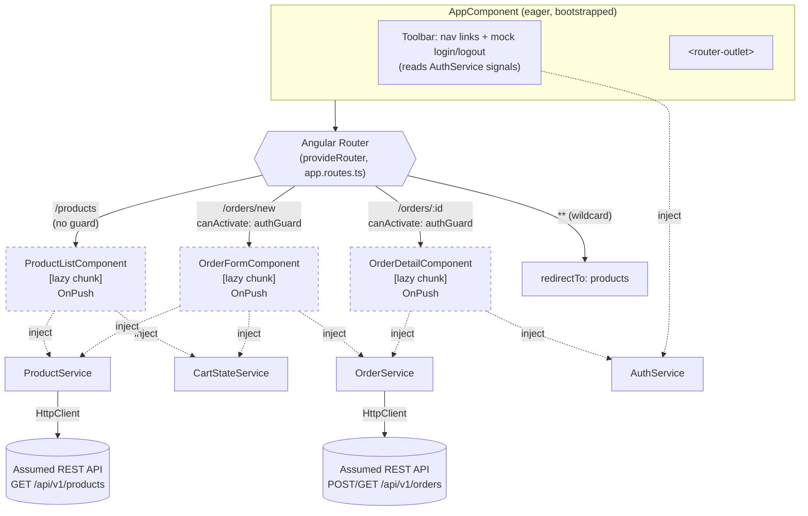

# Component Tree & Routing Structure

This module's `AppComponent` shell hosts a single `<router-outlet>`. Every
feature component is standalone and lazy-loaded (`loadComponent`) — there
are no `NgModule`s anywhere in this app, and no eagerly-bundled feature
component either, so the diagram below doubles as the lazy-loading
boundary map: each dashed box is its own JS chunk, fetched only on first
navigation to that route.



## Reading this diagram

- **Solid arrows** from the Router to a feature component represent a route
  match; the dashed border on those three boxes signals "lazy chunk," not a
  different runtime relationship.
- **Dotted arrows** (`-.->`) are dependency injection, not routing —
  `ProductListComponent` doesn't hold a reference to `ProductService`'s
  instance directly in the tree; Angular's injector supplies it via
  `inject()` at construction time. All four services (`ProductService`,
  `OrderService`, `CartStateService`, `AuthService`) are registered
  `providedIn: 'root'`, so every component gets the SAME singleton instance
  — this is why `CartStateService`'s state (items added on `/products`)
  is still there when you navigate to `/orders/new`: it isn't
  re-instantiated per route.
- `authGuard` sits BETWEEN the Router and `OrderFormComponent`/
  `OrderDetailComponent` conceptually (not drawn as a box here — see
  `interceptor-guard-sequence.md` for its exact position in a request's
  lifecycle) — it can redirect before either component is ever
  constructed.
- `ProductListComponent` is reachable with no guard at all — deliberately,
  to mirror a typical "browse freely, authenticate at checkout" e-commerce
  flow.

## ASCII fallback

```
AppComponent (shell, eager)
 ├─ Toolbar (AuthService)
 └─ <router-outlet>
     ├─ /products         -> ProductListComponent   [lazy] (no guard)
     ├─ /orders/new        -> OrderFormComponent     [lazy] (authGuard)
     ├─ /orders/:id        -> OrderDetailComponent   [lazy] (authGuard)
     └─ ** (wildcard)      -> redirect to /products

Services (providedIn: 'root', singleton across the whole route tree):
  ProductService, OrderService, CartStateService, AuthService
```
