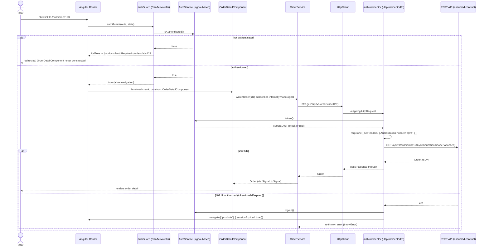

# Sequence: Route Guard + HTTP Interceptor

Two related-but-distinct gates appear in this module, and it's a common
interview mix-up to conflate them:

- **`authGuard`** runs at NAVIGATION time, before a route's component is
  even constructed. It can block/redirect navigation entirely.
- **`authInterceptor`** runs at HTTP REQUEST time, for every outgoing
  `HttpClient` call, regardless of which route triggered it. It doesn't
  block anything — it attaches a header to the outgoing request.

The sequence below shows both, in the order they'd fire for a user
clicking a link to `/orders/abc123` while already logged in.



## Key takeaways

1. **The guard runs once, per navigation attempt.** It never sees
   individual HTTP requests — it only ever calls
   `AuthService.isAuthenticated()`, a synchronous Signal read.
2. **The interceptor runs once per HTTP request**, not once per navigation
   — if `OrderDetailComponent` fired three separate HTTP calls, the
   interceptor would run three times, once per call, each reading the
   CURRENT token at that moment (relevant if a token is refreshed
   mid-session).
3. **Neither of these is the real security boundary.** Both are
   client-side conveniences that improve UX (don't render a screen you
   can't use; don't send a request you know will be rejected) and reduce
   wasted network calls. The actual enforcement — verifying the JWT's
   signature and expiry, checking the caller's role against the requested
   operation — happens server-side, in Spring Security's filter chain and
   method security (`security/`, Module 6). A user with browser devtools
   open can bypass the guard (navigate the router state directly) and the
   interceptor (call the API directly with `fetch`/curl and a forged or
   missing header) — the backend must reject those requests independently
   of anything this module does.

## ASCII fallback

```
User clicks /orders/abc123
  -> Router invokes authGuard
       -> AuthService.isAuthenticated()?
            NO  -> guard returns UrlTree(/products?authRequired=...) -> redirect, stop
            YES -> guard returns true -> Router proceeds
  -> OrderDetailComponent lazy-loads and constructs
  -> OrderService.watchOrder() -> HttpClient.get(/api/v1/orders/abc123)
       -> authInterceptor reads AuthService.token()
       -> clones request with Authorization: Bearer <token>
       -> sends to API
            200 -> Order flows back through Observable -> toSignal -> template renders
            401 -> interceptor calls AuthService.logout(), redirects to /products, rethrows error
```
