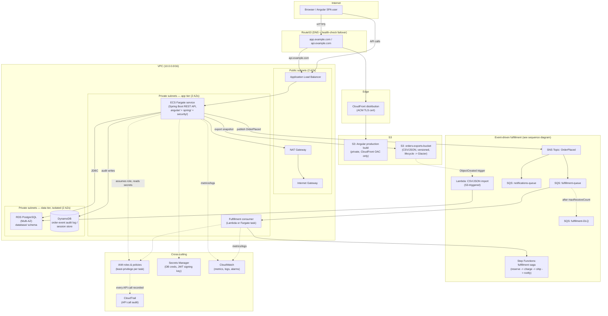

# AWS Architecture — Order/Inventory System

Companion to [../README.md](../README.md). Two diagrams: the full deployed architecture (this file) and the event-driven fulfillment sequence ([event-driven-fulfillment-sequence.md](event-driven-fulfillment-sequence.md)).

**Reminder:** this is an illustrative target architecture for teaching purposes — it is not deployed anywhere from this repo. See [../terraform/](../terraform/) for the corresponding (also illustrative, not-for-`apply`) HCL.

## Reading notes

- **Public vs. private subnets**: only the ALB and NAT Gateway sit in public subnets with a route to the Internet Gateway. The ECS Fargate tasks and the fulfillment consumer are in private app subnets — reachable only via the ALB, with outbound internet access (for Secrets Manager, third-party calls) routed through NAT. RDS and DynamoDB-adjacent app traffic sit in isolated private data subnets with no internet route at all.
- **CloudFront + S3 vs. ALB + ECS** are two separate paths: static Angular assets never touch the ECS tier; API calls never touch the S3/CloudFront path (in this design — an alternative would put CloudFront in front of the API too for edge caching of cacheable GETs, not modeled here to keep the diagram focused).
- **The messaging subgraph** is expanded in detail, with exact message ordering, in the sequence diagram — this diagram only shows *what* is wired to *what*, not the order events happen in.
- **Cross-cutting concerns** (IAM, Secrets Manager, CloudWatch, CloudTrail) apply to every compute component; they're drawn once here rather than repeated on every arrow to keep the diagram legible — see [../README.md](../README.md) §1, §8, §9 for exactly which permissions/secrets/metrics apply to which component.
