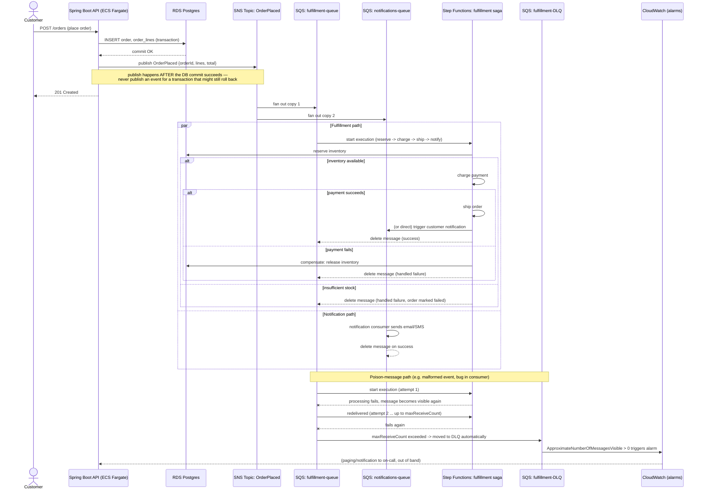

# Event-Driven Order Fulfillment — Sequence Diagram

Companion to [../README.md](../README.md) §6 (SQS/SNS/EventBridge) and §7 (Step Functions). Shows the happy path and the poison-message/DLQ path for one `OrderPlaced` event, from the moment `OrderService.placeOrder(...)` (Module 1) succeeds through to fulfillment.

## Reading notes

- **Publish-after-commit**: the API only publishes `OrderPlaced` after the RDS transaction commits — publishing before commit risks announcing an order that a subsequent rollback then makes untrue, and downstream consumers (fulfillment, notifications) have no way to know the announcement was retracted.
- **Fan-out via SNS**: one publish, two independent deliveries (fulfillment queue, notifications queue) — the two consumers don't know about each other and can fail/scale/retry independently. See README §6 for why SNS (not calling both queues directly from the API) is the right shape here.
- **Step Functions as the fulfillment consumer's orchestrator**: the SQS message triggers a Step Functions execution rather than one monolithic Lambda, specifically so each step (reserve/charge/ship/notify) has its own retry policy and — on failure — its own compensating branch, exactly as detailed in README §7.
- **At-least-once delivery**: SQS can redeliver a message that wasn't deleted in time (visibility timeout expiry) or whose consumer crashed mid-processing — this is why every step in the saga (and the consumer itself) must be idempotent (reserving the same order's inventory twice must be a safe no-op, not a double reservation).
- **DLQ + alarm, not silent failure**: after `maxReceiveCount` failed attempts, SQS moves the message to the DLQ automatically (no consumer code needed to implement this) — but a DLQ with no alarm wired to it is just a quieter place for the problem to hide. The CloudWatch alarm on DLQ depth is what turns "the message is safely parked" into "a human found out."
