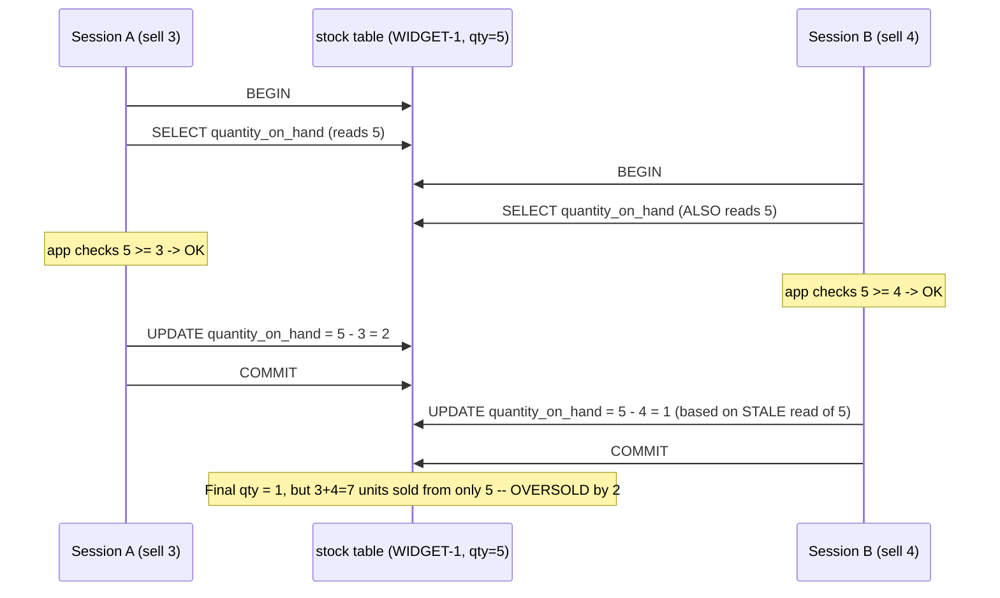
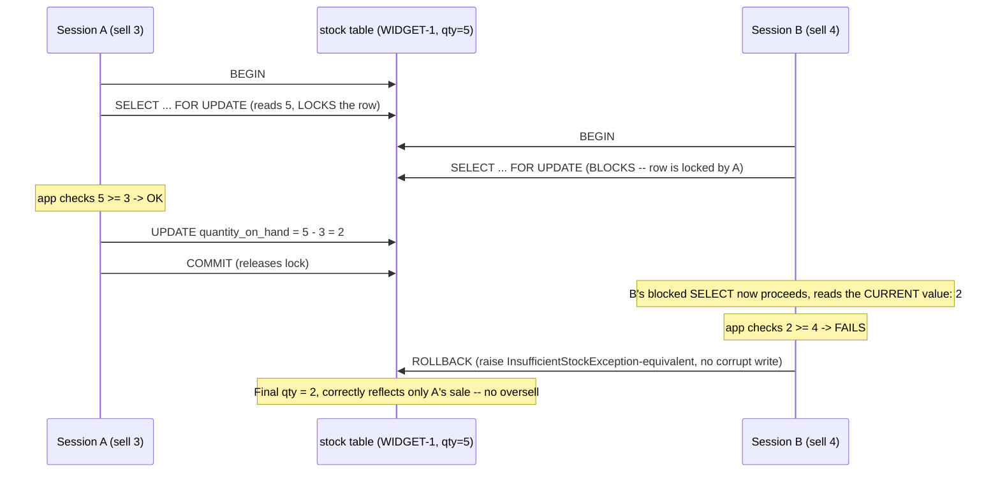
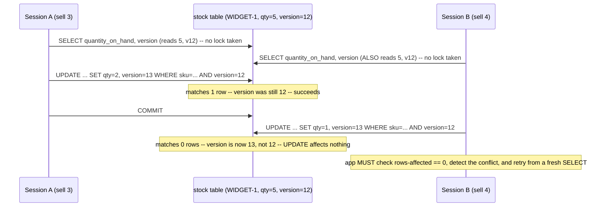

# Transaction & Locking Flow — Stock Decrement Race Condition

Companion diagram to `sql/transactions-and-locking.sql` Section D. Shows two
concurrent sessions both trying to sell the last few units of the same SKU,
first WITHOUT protection (the bug), then WITH `SELECT ... FOR UPDATE`
(pessimistic locking) fixing it.

## 1. The bug — unprotected read-then-write (READ COMMITTED, no locking)

This is the database-level twin of `Inventory.reserve()`'s documented Java
race condition (`java-basics/src/main/java/com/interviewprep/orders/domain/Inventory.java`)
— same read-check-write gap, different layer (DB transactions instead of
JVM threads).

## 2. The fix — pessimistic locking with `SELECT ... FOR UPDATE`

## 3. The alternative fix — optimistic locking with a `version` column

## Which one applies to which real scenario

| Scenario | Preferred approach | Why |
|---|---|---|
| Flash sale, one SKU everyone wants right now | Pessimistic (`FOR UPDATE`) | High contention on the same row — cheaper to queue than to retry repeatedly |
| Normal order flow across many different customers/SKUs | Optimistic (`version` column) | Low contention — most transactions touch different rows, so locking overhead isn't worth paying on every write |
| Crash mid-transaction (either approach) | Database transaction (`BEGIN`/`COMMIT`/`ROLLBACK`) | Neither locking strategy matters if the whole statement sequence isn't wrapped in one atomic transaction to begin with — see `transactions-and-locking.sql` Section A for why this is *more* than what `OrderService.placeOrder()`'s hand-rolled try/catch provides in Java (it also survives a crash, not just a caught exception) |
