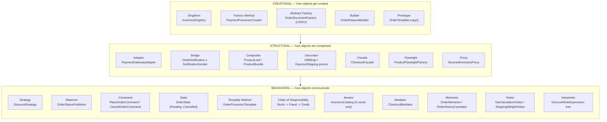

# Module 4 — SOLID, GRASP, and All 23 GoF Design Patterns

**Domain used throughout:** the same Order/Inventory system introduced in
[java-basics](../java-basics) (Module 1) — `Customer`, `Product`, `Order`,
`OrderLine`, `Inventory`, `OrderStatus`, `OrderService`. Nothing in
java-basics is modified; this module imports those classes and builds
alongside them. Every pattern below is demonstrated with a WRONG (naive)
implementation and a CORRECT (pattern-applied) implementation, side by
side, in the same small domain — so you're learning to recognize "this
smells like a Strategy problem" in code that looks like YOUR code, not an
abstract `Shape`/`Circle`/`Square` toy example.

Companion files:
- [SOLID.md](SOLID.md) — the 5 SOLID principles, each with a violation and fix
- [GRASP.md](GRASP.md) — the 9 GRASP principles, each with a domain example
- [diagrams/gof-pattern-categories.md](diagrams/gof-pattern-categories.md) — the 23-pattern categorization diagram below, as a standalone file
- [src/main/java/.../patterns/creational/](src/main/java/com/interviewprep/orders/patterns/creational) — Singleton, Factory Method, Abstract Factory, Builder, Prototype
- [src/main/java/.../patterns/structural/](src/main/java/com/interviewprep/orders/patterns/structural) — Adapter, Bridge, Composite, Decorator, Facade, Flyweight, Proxy
- [src/main/java/.../patterns/behavioral/](src/main/java/com/interviewprep/orders/patterns/behavioral) — Strategy, Observer, Command, State, Template Method, Chain of Responsibility, Iterator, Mediator, Memento, Visitor, Interpreter
- [EXPLANATION.md](EXPLANATION.md) — walkthrough of every wrong/correct pair
- [EXERCISES.md](EXERCISES.md) — hands-on exercises, increasing difficulty
- [INTERVIEW.md](INTERVIEW.md) — beginner/intermediate/senior/scenario interview questions with ideal answers

---

## Why this is the largest module in the curriculum, and why it matters

Design pattern questions are one of the FEW interview topics that appear
consistently across every company this curriculum targets — S&P Global,
JPMorgan, and Goldman Sachs lean on them heavily in senior Java rounds
(often as a live-refactoring exercise: "here's a class, what's wrong with
it, fix it"), while Amazon, Microsoft, Google, and the product companies
(Adobe, Salesforce, Atlassian) fold pattern recognition into system-design
and code-review rounds rather than asking about patterns by name. Either
way, the underlying skill is the same: recognizing a RECURRING SHAPE of
problem (varying algorithm, incompatible interface, God object, growing
if/else chain) and reaching for the right, PROVEN structural fix instead of
inventing an ad hoc one under interview pressure — or worse, over-applying
a fashionable pattern where a simpler fix would do (also a real interview
red flag, covered throughout INTERVIEW.md).

**How to use this module:** breadth over depth is deliberate — every one of
the 23 GoF patterns gets a real, compilable wrong/correct pair, but each
pair is kept compact (one small file or a tight cluster of files) rather
than a sprawling multi-class demo app per pattern. The goal is that you can
look at any pattern's folder, read two or three files, and walk away able
to explain: what problem it solves, what it costs, and when NOT to reach
for it — the last part is at least as important for interviews as knowing
the pattern exists.

---

## SOLID and GRASP first, then GoF

SOLID and GRASP are covered in their own files
([SOLID.md](SOLID.md), [GRASP.md](GRASP.md)) because they're PRINCIPLES —
general design lenses that apply everywhere, in code that uses zero GoF
patterns. The 23 GoF patterns that follow are best understood as SPECIFIC,
NAMED, BATTLE-TESTED TECHNIQUES for satisfying one or more of those
principles in a particular recurring situation (e.g. Strategy is "how to
satisfy Open/Closed when the varying thing is an algorithm"; Adapter is
"how to satisfy Protected Variations when the varying thing is a
third-party interface you don't control"). Read SOLID.md and GRASP.md
first — the GoF sections constantly reference back to them.

---

## All 23 GoF Patterns, Categorized



**How to read this diagram in an interview:** if asked "what are the three
GoF categories," the useful answer isn't just naming them — it's explaining
the ORGANIZING QUESTION each category answers: Creational = "how does this
object come into existence?", Structural = "how do these objects fit
together into larger structures?", Behavioral = "how do these objects
communicate and share responsibility for a task?" A pattern's category
tells you what KIND of problem it addresses before you even recall its
mechanics.

---

## Quick-reference: pattern → problem it solves → this module's anchor

| Category | Pattern | Problem it solves | Anchor example |
|---|---|---|---|
| Creational | Singleton | Ensure exactly one instance is reachable globally | `InventoryRegistry` (with a strong caveat about DI replacing it) |
| Creational | Factory Method | Defer object creation to subclasses/a dedicated creator | `PaymentProcessorCreator` / `PaymentProcessorFactory` |
| Creational | Abstract Factory | Create a FAMILY of related objects consistently | `OrderDocumentFactory` (US vs. EU invoice+receipt) |
| Creational | Builder | Construct a complex object step by step, optional parts | `OrderRequestBuilder` (gift wrap, notes, discount code) |
| Creational | Prototype | Create new objects by copying an existing one | `OrderTemplate.copy()` |
| Structural | Adapter | Make an incompatible interface usable | `PaymentGatewayAdapter` wrapping a third-party gateway |
| Structural | Bridge | Decouple an abstraction from its implementation | `OrderNotification` × `NotificationSender` |
| Structural | Composite | Treat individual objects and groups uniformly | `ProductLeaf` / `ProductBundle` |
| Structural | Decorator | Add responsibilities to an object dynamically | Gift wrap / express shipping price surcharges |
| Structural | Facade | Simplify a complex subsystem behind one interface | `CheckoutFacade` |
| Structural | Flyweight | Share immutable state to reduce memory | `ProductFlyweightFactory` |
| Structural | Proxy | Control access to another object | `SecuredInventoryProxy` |
| Behavioral | Strategy | Swap an algorithm without conditionals | `DiscountStrategy` |
| Behavioral | Observer | Notify many listeners of a state change | `OrderStatusPublisher` |
| Behavioral | Command | Encapsulate a request as an object (undo/queue/log) | `PlaceOrderCommand` / `OrderCommandInvoker` |
| Behavioral | State | Vary behavior by an object's internal state | `OrderState` hierarchy |
| Behavioral | Template Method | Fix an algorithm's skeleton, vary its steps | `OrderProcessorTemplate` |
| Behavioral | Chain of Responsibility | Pass a request along a chain of handlers | Stock → Fraud → Credit validation |
| Behavioral | Iterator | Traverse a collection without exposing its structure | `InventoryCatalog` (in-stock only) |
| Behavioral | Mediator | Centralize communication between colleagues | `CheckoutMediator` |
| Behavioral | Memento | Capture/restore an object's state (undo) | `OrderMemento` / `OrderHistoryCaretaker` |
| Behavioral | Visitor | Add operations to a class hierarchy without modifying it | `TaxCalculationVisitor` over `ProductLeaf`/`ProductBundle` |
| Behavioral | Interpreter | Represent and evaluate a small grammar/rule set | `DiscountRuleExpression` tree |

---

## How to build/verify this module

**No compiler is available in the sandbox this module was authored in** —
every file was hand-verified for brace/paren balance, package-declaration
correctness, and that every cross-file import resolves to an actual
declared class, but it has not been run through `javac`. When you have a
JDK available (17+ recommended to match the rest of this repo), compile
BOTH source roots together, since this module's code imports domain
classes from java-basics:

```bash
javac -d out $(find java-basics/src/main/java design-patterns/src/main/java -name "*.java")
```

If that succeeds with no errors, every class in both modules is
syntactically and semantically valid Java. There is no `Main` class wiring
every pattern together (breadth over depth — see above), but each
"correct" pattern class's Javadoc includes a `USAGE EXAMPLE` block showing
how to instantiate and call it; pasting one of those into a scratch
`Main.java` alongside the two source roots above is the fastest way to see
a specific pattern run.

## Next module

Module 5 — Spring Core, Spring Boot, Spring Data JPA, Spring Security —
picks up directly from several threads deliberately left open here: the
hand-rolled `InventoryRegistry` Singleton gets replaced by a Spring-managed
singleton-scoped `@Bean`; `OrderStatusPublisher` (Observer) gets replaced by
Spring's `ApplicationEventPublisher`; and `CheckoutFacade` becomes the
natural shape of a `@Service` called from a `@RestController`. Not started
until you confirm this module is solid.
