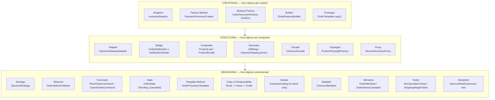

# All 23 GoF Patterns, Categorized

Extracted from [../README.md](../README.md) section "All 23 GoF Patterns, Categorized" so this module has a `diagrams/` folder consistent with every other module in the repo. Read the README section for the full "how to read this in an interview" discussion — this file is the diagram alone, for quick reference.

**How to read this diagram in an interview:** if asked "what are the three GoF categories," the useful answer isn't just naming them — it's explaining the organizing question each category answers: Creational = "how does this object come into existence?", Structural = "how do these objects fit together into larger structures?", Behavioral = "how do these objects communicate and share responsibility for a task?" A pattern's category tells you what kind of problem it addresses before you even recall its mechanics.
