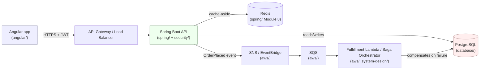

# docs/

Cross-cutting documentation that doesn't belong to any single module: a glossary, architecture decision records (ADRs) for choices that span modules, and the "put it all together" diagram.

## Glossary

Terms used across multiple modules, defined once here instead of repeated with slightly different wording in each:

| Term | Definition | Where it matters most |
|---|---|---|
| The domain | Customer, Product, Order, OrderLine, Inventory/stock, OrderStatus — the one running example every module extends | [java-basics/](../java-basics/) |
| SKU | Stock Keeping Unit — the string identifier for a Product, used as the key into Inventory's stock map / the `stock` table's PK | java-basics, database |
| Saga | A sequence of local transactions across services, each with a compensating action if a later step fails — the distributed generalization of `OrderService.placeOrder()`'s manual rollback | system-design |
| Bounded context | A DDD boundary within which a term (e.g. "Order") has one consistent meaning and model — Ordering, Inventory, Payments, Shipping, Customer in this system | system-design |
| Cache-aside | A caching pattern where the application checks the cache first, falls through to the DB on a miss, then populates the cache — the pattern `spring/`'s `@Cacheable` stock lookups use | spring |
| Optimistic vs. pessimistic locking | Optimistic: detect conflicting concurrent writes after the fact via a version column; pessimistic: prevent them up front via `SELECT ... FOR UPDATE`. Both solve the same over-selling problem `Inventory.reserve()` has, at the DB layer | database, java-advanced/concurrency |
| Bearer token | An access credential (here, a JWT) presented in the `Authorization: Bearer <token>` header, trusted for whoever holds it | security, angular |
| Idempotency | An operation that produces the same result no matter how many times it's applied — relevant to Lambda/SQS message redelivery and to retries in general | aws, system-design |

## ADRs (decisions that span modules)

**ADR-1: Every module is an independently-buildable unit, not one Maven multi-module reactor.**
`java-basics/` compiles with plain `javac`. `spring/`, `security/`, and `testing/` each have their own standalone `pom.xml` rather than sharing one parent POM or a multi-module reactor build. `spring/` and `security/` even define their own separate `entity`-equivalent copies of domain concepts rather than importing one shared library.
- **Why:** this is a teaching repository meant to be read one module at a time. A shared reactor build (or a shared `domain-core` artifact `spring`/`security`/`testing` all depend on) would mean understanding any one module requires understanding the build topology of all of them first — exactly the kind of incidental complexity this repo tries to avoid. The cost — real duplication, e.g. `OrderStatus`'s transition rules exist in `java-basics`, `spring`, and conceptually in `system-design`'s saga design — is explicit and bounded.
- **When this call would be wrong:** in a real product codebase, not a teaching one. There, the duplication above would be a genuine liability (drift between copies, N places to fix the same bug) and a shared module/library would be the correct engineering decision. Every module that makes this trade-off says so explicitly in its own README — this ADR just collects them in one place.

**ADR-2: JPA entities are separate classes from java-basics' records, not the same classes reused.**
`spring/`'s `Customer`/`Product`/`Order`/`OrderLine` are new `@Entity`-annotated classes, not the records from `java-basics/`.
- **Why:** records are structurally incompatible with what a JPA persistence provider needs (no-arg constructor, mutable post-construction field assignment, subclassable for lazy-loading proxies) — see `spring/README.md` section 0 for the full reasoning. This isn't a style preference; records genuinely cannot do this job.
- **How to apply:** if you ever see a design that tries to force an immutable value type into a persistence-managed entity role (in this repo or elsewhere), that tension is the signal — separate the concepts, don't fight the tool.

**ADR-3: Inventory is a field on Product in `spring/`, not a separate entity/table — even though `java-basics/` models it as a separate class.**
- **Why:** `spring/README.md` section 6 argues a separate `Inventory`/`stock` table only earns its cost with multiple warehouses or a per-movement audit ledger — neither of which this system's scope needs. `java-basics/` keeps `Inventory` separate because that separation is itself the Module 1 lesson (decoupling a service class from the domain objects it operates on) — a pedagogical reason, not a data-modeling one.
- **When this call would be wrong:** the moment multi-warehouse support or a stock-movement audit trail becomes a real requirement — at that point, promote it back to its own entity, exactly as `java-basics/Inventory.java` already models it.

## The system, end to end

Once every module's code is combined into one running deployment (not done in this repo — each module is independently buildable, per ADR-1 — but this is the shape it would take):

Every arrow in this diagram is something a specific module explains in depth: the browser→API leg is `security/`'s JWT flow; the API→DB leg is `database/`'s transaction/locking coverage; the event-driven leg is `aws/`'s SQS/SNS/EventBridge section and `system-design/`'s Saga pattern. `java-advanced/` (file-io, concurrency, jvm-internals) and `design-patterns/` and `testing/` aren't boxes on this diagram — they're the internals and disciplines that make every box in it correct and maintainable.

See the root [README.md](../README.md) for the full module roadmap and links into every module.
