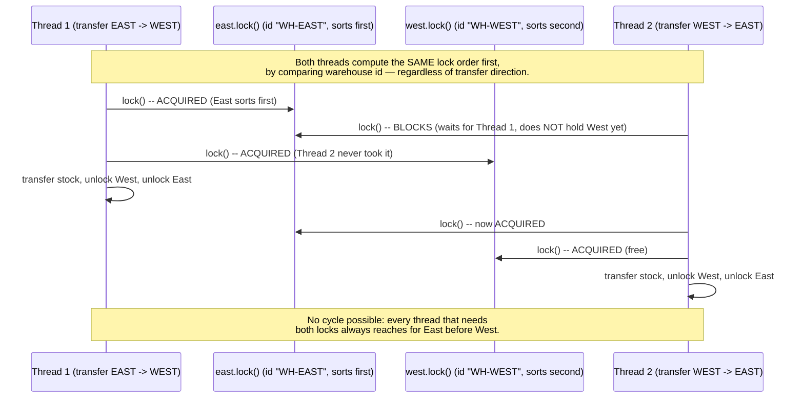

# Deadlock — `StockTransferService.transferUnsafe` Interleaving

Thread 1 transfers stock EAST → WEST; Thread 2 concurrently transfers stock
WEST → EAST. Both use `transferUnsafe`, which locks `from` then `to` in
whatever order the CALLER passed them — with no global consistency, the two
threads acquire the two locks in OPPOSITE orders, which is what makes the
cycle possible.

```mermaid
sequenceDiagram
    participant T1 as Thread 1 (transfer EAST -> WEST)
    participant East as east.lock()
    participant West as west.lock()
    participant T2 as Thread 2 (transfer WEST -> EAST)

    T1->>East: lock() -- ACQUIRED
    T2->>West: lock() -- ACQUIRED
    Note over T1,T2: Both threads now hold one lock each<br/>and are about to reach for the OTHER one.

    T1->>West: lock() -- BLOCKS (held by Thread 2)
    T2->>East: lock() -- BLOCKS (held by Thread 1)

    Note over T1,East,West,T2: CIRCULAR WAIT:<br/>T1 holds East, wants West (held by T2).<br/>T2 holds West, wants East (held by T1).<br/>Neither can ever proceed. This is a deadlock.
```

## Why `transferUnsafe` sleeps between acquiring the first lock and the second

`holdDelayMillis` (passed as 300ms in `DeadlockDemo`) deliberately widens the
window between "acquire the first lock" and "attempt the second," making the
two threads far more likely to both be holding one lock and waiting on the
other AT THE SAME TIME. Without this, one thread might race through both
`lock()` calls before the other thread even starts, and the deadlock —
though still POSSIBLE — would be much rarer to observe in a short demo run.
This is the same "widen the interleaving window to make a timing bug
reliably observable" idea as the race-condition stress test, applied to
locks instead of a shared map.

## How production tooling detects this (and how `DeadlockDemo` mirrors it)

Once both threads are permanently blocked, `DeadlockDemo` polls
`ThreadMXBean.findDeadlockedThreads()` — the JVM's built-in cycle detector
over threads blocked on monitors and `java.util.concurrent` lock
synchronizers. This is the exact mechanism behind:
- `jstack -l <pid>` printing `"Found one Java-level deadlock:"` with each
  thread's full stack and the lock it's waiting on.
- IDE debugger thread views and tools like VisualVM/JDK Mission Control
  flagging deadlocked threads directly in their UI.

## Fix #1 — Consistent lock ordering (`transferOrdered`)



## Fix #2 — `tryLock` with timeout (`transferWithTimeout`)

Instead of a global order, each thread attempts BOTH locks with a bounded
wait; if it can't get the second lock in time, it releases the first
immediately and retries after a randomized backoff — trading a little
retry work for a guarantee that no thread ever blocks forever. See
`StockTransferService`'s Javadoc for the full livelock-avoidance discussion
(why the backoff must be randomized, not fixed).
