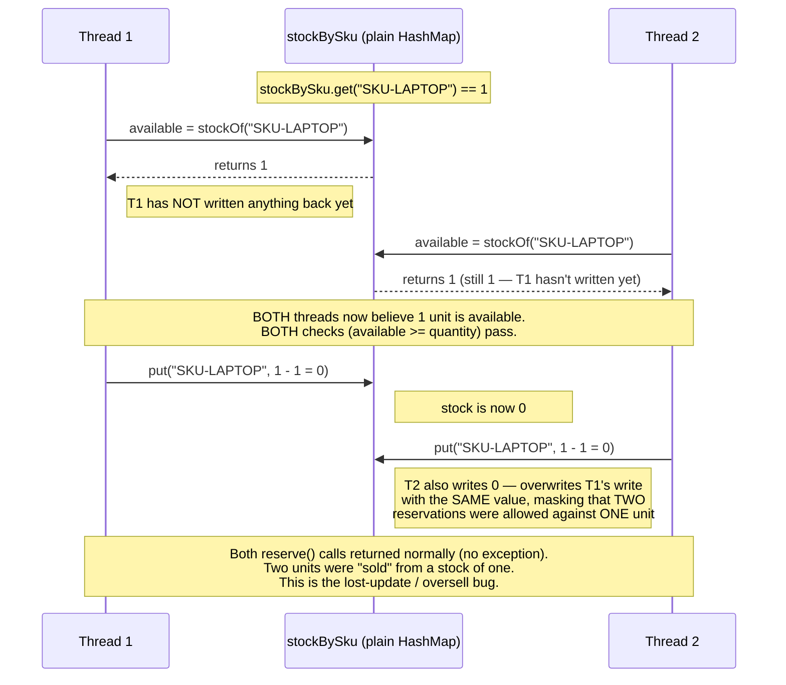

# Race Condition — `Inventory.reserve()` Interleaving

Two threads both calling `reserve("SKU-LAPTOP", 1)` when exactly 1 unit is in
stock. Neither thread does anything individually wrong — `reserve()`'s three
steps (read, check, write) are each valid on their own. The bug is entirely
in the GAP between steps, where the OTHER thread gets to run.

## Why `InventoryStressTester` uses many threads and iterations, not one pair of calls

The window between "read `available`" and "write the decremented value" is a
handful of nanoseconds. A single pair of concurrent `reserve()` calls has a
real but small chance of actually landing inside that window — most of the
time, one thread's read-check-write completes fully before the other thread's
even starts, and the bug simply doesn't manifest for that particular call.

Running 8 threads × 200 calls each against the same SKU means there are
`~1600` opportunities for two calls to collide inside the window during a
single run — high enough that the bug reliably shows up within a handful of
executions, without being mathematically guaranteed on any single run. See
`RaceConditionDemo` and the README's "Race Conditions" section for the full
discussion of why this non-determinism itself matters.

## How each fix closes the window

- **`ConcurrentInventory`** (`ConcurrentHashMap.compute()`): the read, check,
  and write for one key all happen inside ONE call, under the JDK's internal
  per-bin lock — there is no gap between them for another thread to observe.
- **`SynchronizedInventory`** / **`StripedLockInventory`**: an explicit lock
  is held across the read-check-write sequence; a second thread calling
  `reserve()` for the same protected key/stripe blocks until the first
  thread releases the lock, by which point the write has already happened —
  the second thread's read then sees the UPDATED value, not the stale one.
