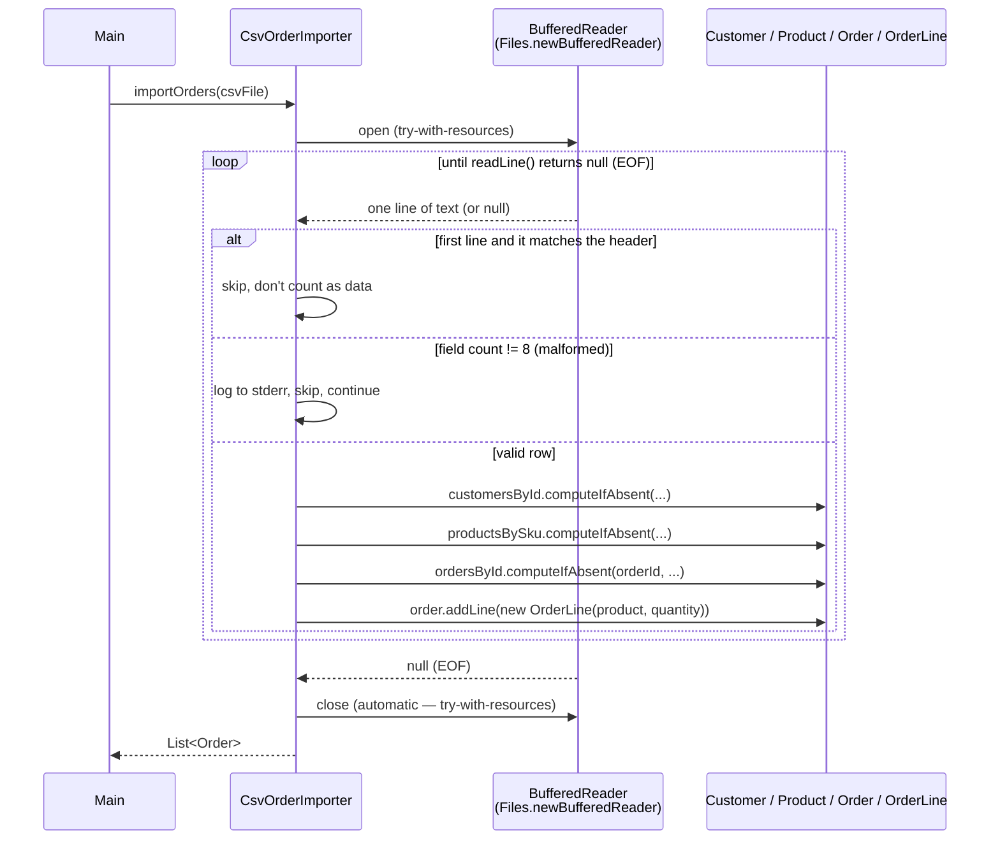

# CSV Import Pipeline (streaming, line-by-line)

This is `CsvOrderImporter.importOrders(Path)` — the "correct" streaming
importer described in [../README.md](../README.md), contrasted there against
the naive `Files.readAllLines()` version.



**The one fact that matters for "large-file processing":** at any point in
the loop, exactly one raw text line is held in memory (plus the small,
bounded set of `Order`/`Customer`/`Product` objects built so far). Memory use
scales with *distinct orders/customers/products seen*, not with *file size in
bytes*. The naive alternative (`Files.readAllLines()`) instead materializes
every line of the file as a `List<String>` before the loop even starts —
memory use there scales directly with file size, which is what makes it
unsafe for a multi-GB batch file.

## ASCII fallback

```
Main --importOrders(path)--> CsvOrderImporter
                                  |
                                  v
                     open BufferedReader (try-with-resources)
                                  |
                    +-------------+-------------+
                    |   loop: readLine()         |
                    |     -> null => EOF, exit   |
                    +-------------+-------------+
                                  |
                     is it the header line? --yes--> skip
                                  | no
                     fields.length != 8? --yes--> log + skip
                                  | no
                     computeIfAbsent Customer / Product / Order
                                  |
                     order.addLine(new OrderLine(...))
                                  |
                                  v
                          (loop back to readLine())
                                  |
                    reader closes automatically at EOF/exception
                                  |
                                  v
                       return List<Order> to Main
```
