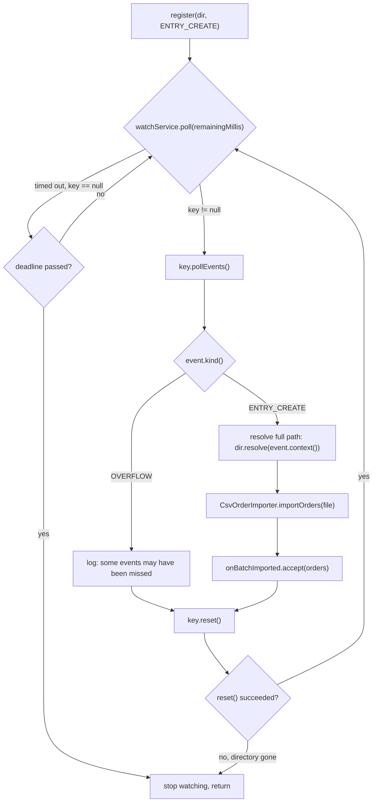

# WatchService Event Handling Flow

This is `OrderImportWatcher.watchOnce(Path, Duration, Consumer<List<Order>>)`
— see [../README.md](../README.md) for the full discussion of what
WatchService does and doesn't guarantee (delivery is best-effort; OVERFLOW
events mean some were dropped).



**The bug this diagram is designed to make obvious:** `key.reset()` at the
bottom of the loop is not optional cleanup — skip it and the directory
silently stops delivering events after the very first one, with no exception
thrown anywhere. This is the single most common WatchService mistake, and the
diagram exists mainly to show *where* in the loop it has to happen (after
processing every event batch, unconditionally, before polling again).

## ASCII fallback

```
 register dir for ENTRY_CREATE
            |
            v
   +--------------------+
   |  poll(remaining ms) |<-------------------------+
   +--------------------+                           |
            |                                        |
   key == null (timed out)?                          |
      |                  \                           |
     yes                  no                         |
      |                    \                          |
  deadline passed?      key.pollEvents()               |
   |        \                 |                        |
  yes        no          for each event:                |
   |          \               |                         |
  STOP       (loop)      OVERFLOW?  ENTRY_CREATE?        |
                          |            |                 |
                     log+continue   resolve path          |
                                       |                   |
                                 importOrders(file)         |
                                       |                    |
                                 onBatchImported.accept()    |
                                       |                     |
                                       v                     |
                                  key.reset() ----------------+  (loop again if valid)
                                       |
                                reset() == false?
                                       |
                                      yes -> STOP (directory gone)
```
