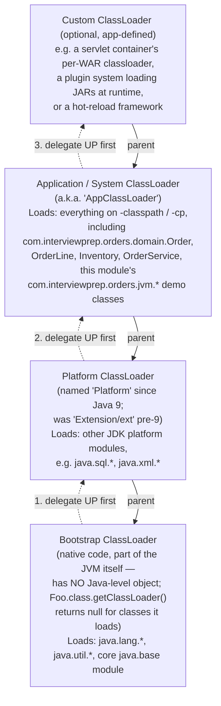

# Classloader Delegation Hierarchy

## The delegation model, read correctly

Arrows above point from child to **parent** (that's the actual object
reference a classloader holds via `getParent()`). But the *delegation
model* — the behavior — flows the opposite direction at load time:

1. Some code asks the **Application** classloader to load
   `com.interviewprep.orders.domain.Order`.
2. Before trying itself, Application asks its parent, **Platform**, "can
   you load this?"
3. Platform asks *its* parent, **Bootstrap**, first.
4. Bootstrap doesn't have it (it only knows `java.*`/`javax.*` core
   classes) → fails back down to Platform.
5. Platform doesn't have it either (it's not a JDK platform module class)
   → fails back down to Application.
6. **Application** finally looks on its own classpath, finds
   `Order.class`, and loads it.

This is **parent-first delegation**, and it's a deliberate security/
integrity feature: it's what makes it impossible for application code to
sneak in its own `java.lang.String` and have it silently used instead of
the JDK's — the Bootstrap loader is always asked first for anything in a
`java.*` package, and (since Java 9's module system) the JVM additionally
refuses to even define application classes in a `java.*` package.

## Where `ClassNotFoundException` vs. `NoClassDefFoundError` fit

- **`ClassNotFoundException`** happens *during* the delegation walk above:
  every classloader in the chain, all the way down to the one being asked,
  fails to find the class. This is only thrown for an **explicit** load
  request (`Class.forName(...)`, `classLoader.loadClass(...)`, or the
  implicit one the JVM does the very first time a class is referenced).
- **`NoClassDefFoundError`** happens when a class *was* successfully found
  and loaded (often at compile time, by the compiler, and initially at
  runtime too) but a *later* attempt to use it fails — most commonly
  because (a) the class file disappeared from the classpath between
  builds/deploys, or (b) the class's own static initializer threw once
  already (see `ClassLoaderHierarchyDemo.java` for a runnable, deterministic
  reproduction of case (b) using a poisoned `<clinit>`).

See README section 3 for the full write-up, including the Java 9+ module
system's interaction with this picture (module boundaries + strong
encapsulation sit *on top of* this classloader delegation model, not in
place of it).
