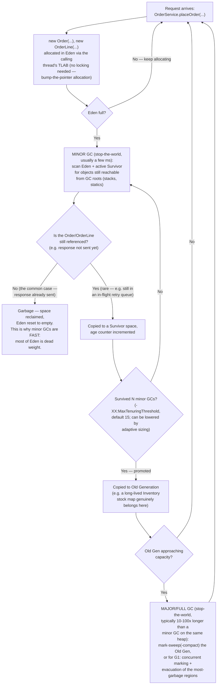

# GC Cycle Flow — Minor GC, Promotion, Major/Full GC

Applied to the Order/Inventory system: imagine `OrderService.placeOrder(...)`
running thousands of times per second. Every call allocates at least one
`Order` and one or more `OrderLine`s. Almost all of them become garbage
within milliseconds (once the HTTP response is sent, nothing holds a
reference to that `Order` anymore) — this is the **generational hypothesis**
in action, and it's why the young generation exists as a separate, cheaply
collected region.

## Reading this diagram

- **Minor GC** only touches the young generation (Eden + Survivor). Because
  most `Order`/`OrderLine` objects in a request-scoped service die almost
  immediately, a minor GC typically reclaims 90%+ of Eden — this is why
  minor GCs, despite being stop-the-world, are usually sub-10ms events and
  happen frequently without users noticing.
- **Promotion** is the mechanism by which a genuinely long-lived object
  (in this domain: something like a cached `Inventory` snapshot or a
  connection-pool object, *not* a per-request `Order`) migrates out of the
  young generation into Old Gen, where it's collected far less often.
- **Major/Full GC** is expensive precisely because Old Gen is (by design)
  full of objects that were promoted *because* they were still alive last
  time — the "most garbage is already dead" shortcut minor GC relies on
  doesn't hold in Old Gen, so a full mark-and-compact (or, for G1, a mostly
  concurrent mark + a stop-the-world evacuation pause) is needed instead.
- **Anti-pattern this diagram exposes:** if a service accidentally holds
  onto `Order` references longer than it should (e.g. an unbounded
  in-memory audit log `List<Order>` that's never trimmed), those objects
  survive enough minor GCs to get promoted, bloating Old Gen with objects
  that *should* have died young — a classic slow memory leak that shows up
  as increasing full-GC frequency and pause time over hours/days, not an
  immediate crash. See README section 2 ("Common mistakes").

See [heap-regions.md](heap-regions.md) for the regions this cycle moves
objects between, and README section 2 for how each collector (Serial,
Parallel, G1, ZGC, Shenandoah) implements this cycle differently.
