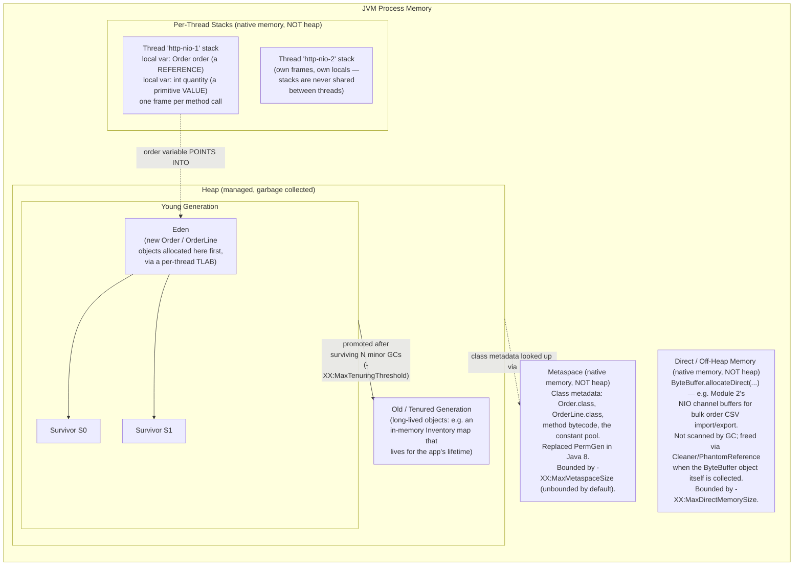

# JVM Memory Layout — Heap, Stack, Metaspace, Off-Heap

Where does an `Order` actually live while `OrderService.placeOrder(...)` is
running? This diagram is the answer key referenced throughout
[README.md](../README.md) section 1.

## Reading this diagram

- **Heap** is the only region the classic `-Xms`/`-Xmx` flags size, and the
  only region GC algorithms (Serial/Parallel/G1/ZGC/Shenandoah) collect.
- **Stack** is per-thread, sized by `-Xss`, and holds *frames* — local
  variables (both primitives and object *references*, never the objects
  themselves) and the call chain. A reference on the stack points into the
  heap; the referenced `Order` object itself is never on the stack.
- **Metaspace** replaced PermGen (Java 8+) specifically so that class
  metadata volume is no longer capped by a heap-adjacent, hard-to-size
  region — see README section 1 for the historical `OutOfMemoryError:
  PermGen space` incidents this fixed, and the new failure mode
  (`OutOfMemoryError: Metaspace`, or unbounded native memory growth) it
  introduced instead.
- **Direct/off-heap memory** is invisible to `-Xmx` and to most heap
  histograms — a service that creates large direct `ByteBuffer`s (Module 2:
  bulk CSV/ZIP import of orders) without bounding `-XX:MaxDirectMemorySize`
  can exhaust native memory while the heap dashboard looks perfectly healthy.

See [gc-cycle-flow.md](gc-cycle-flow.md) for how objects move Eden → Survivor
→ Old, and [jit-tiered-compilation.md](jit-tiered-compilation.md) for how the
JIT can sometimes avoid putting an object in Eden at all (escape analysis /
scalar replacement).
