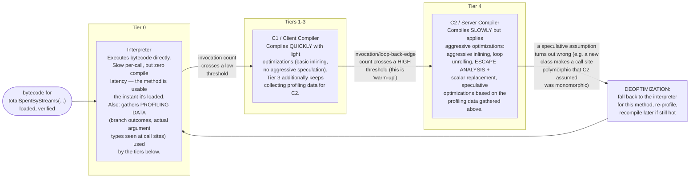

# JIT Tiered Compilation — Interpreter → C1 → C2

Why does `OrderService.totalSpentByStreams(...)` run slowly the first few
thousand calls and then get faster without any code change? This is the
answer.

## Reading this diagram

- **Tiered compilation** (default since Java 8, `-XX:+TieredCompilation`)
  means a method doesn't jump straight from "never run" to "fully
  C2-optimized" — it climbs through interpreter → C1 → C2 as evidence
  accumulates that it's worth the compile cost.
- **Warm-up** is exactly this climb. A JVM benchmark (or a production
  request handled in the first second after deploy) that only exercises
  `totalSpentByStreams` a handful of times never leaves the interpreter/C1
  tiers — it's measuring the slow path, not the steady-state throughput
  the same code will have after a few thousand more calls. This is *the*
  reason naive "loop it once and time it" microbenchmarks are misleading
  (see README section 6 and `NaiveMicrobenchmarkPitfalls.java`).
- **Escape analysis** (mentioned inside the C2 box) only runs at the
  aggressive C2 tier — it's exactly why a tight, hot loop creating
  short-lived `OrderLine` objects that never escape the loop iteration
  might, once fully warmed up, allocate far less than the same code did
  when it was still running interpreted. Cold code gets none of this.
- **Deoptimization** is the safety valve: C2's aggressive optimizations
  are *speculative* — bets based on what's been observed so far, not
  proofs. If reality changes (a new subclass of `Product` gets loaded and
  used at a call site C2 assumed was monomorphic), the JVM discards the
  compiled code for that method and drops back to the interpreter,
  re-profiles, and potentially recompiles — correctness is never
  sacrificed for speed.

See README section 4 for the full discussion of inlining and escape
analysis, and [heap-regions.md](heap-regions.md) for where an object goes
when escape analysis decides it does *not* need to be scalar-replaced.
