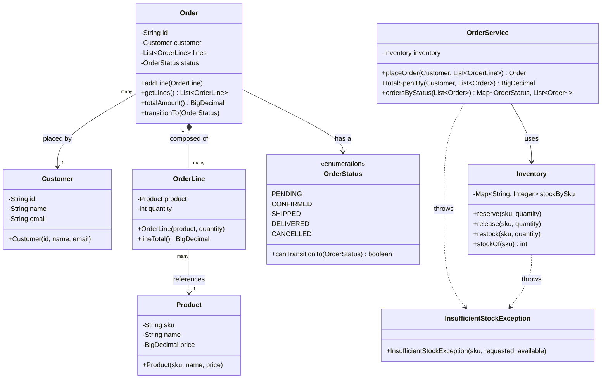

# Domain Model — Order/Inventory System

This is the domain used across every module in this repo. Module 1 implements exactly what's shown here as plain Java objects (no framework). Later modules add persistence (JPA annotations), REST controllers, security constraints, and eventually a `Payment` aggregate — without changing this core shape.

**Key relationships to notice:**
- `Order` *composes* `OrderLine` (filled diamond) — an `OrderLine` cannot outlive or exist independently of its `Order` in this model; this is the "part-whole, part cannot exist without whole" flavor of composition.
- `OrderLine` *references* `Product`, it does not extend it (open arrow) — see the README's OOP section for why inheritance would be wrong here.
- `Inventory` is intentionally decoupled from `Order`/`OrderLine` — it only knows about SKUs and quantities, not the order domain. `OrderService` is what ties them together. This separation is what makes Module 2 (bulk import) and Module 5 (REST layer) able to evolve `Order` and `Inventory` independently.
