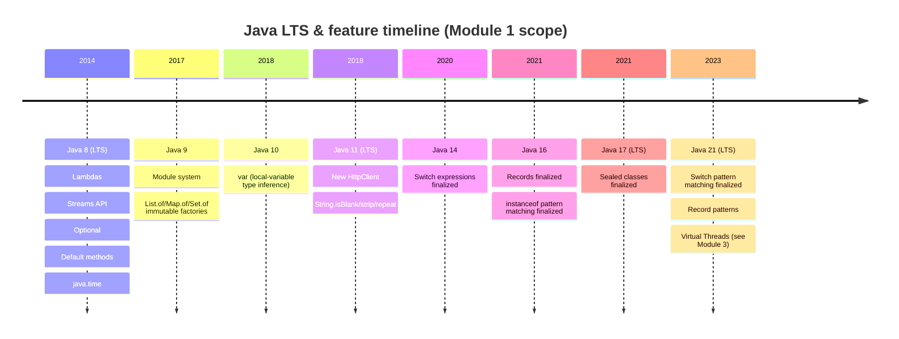

# Java 8 → 21 Evolution Timeline

Scope note: only features that this module (Core Java) touches are detailed here. Virtual Threads (Java 21) are noted for timeline accuracy but explained in depth in Module 3 (Concurrency); `java.nio.file` evolution is explained in Module 2 (File System APIs).



## ASCII fallback (if Mermaid timeline doesn't render in your viewer)

```
2014 ── Java 8  (LTS) ── Lambdas, Streams, Optional, default methods, java.time
2017 ── Java 9        ── Module system, List.of()/Map.of()/Set.of()
2018 ── Java 10       ── var (local-variable type inference)
2018 ── Java 11 (LTS) ── New HttpClient, String.isBlank()/strip()/repeat()
2020 ── Java 14       ── Switch expressions (-> form) finalized
2021 ── Java 16       ── Records finalized, instanceof pattern matching finalized
2021 ── Java 17 (LTS) ── Sealed classes finalized
2023 ── Java 21 (LTS) ── Switch pattern matching finalized, record patterns,
                          Virtual Threads finalized (detail in Module 3)
```

## Why this matters beyond trivia

Each LTS jump tends to correlate with a real migration project at most companies (8→11 for the new HttpClient and module system compatibility; 11→17 for records/sealed classes reducing boilerplate; 17→21 for Virtual Threads changing concurrency architecture). A senior candidate should be able to say *which* LTS a hypothetical legacy codebase is likely stuck on based on code smells (e.g. heavy Lombok `@Value` usage suggests pre-16, before records existed) and what the incremental upgrade path and risk looks like — not just recite the feature list.
