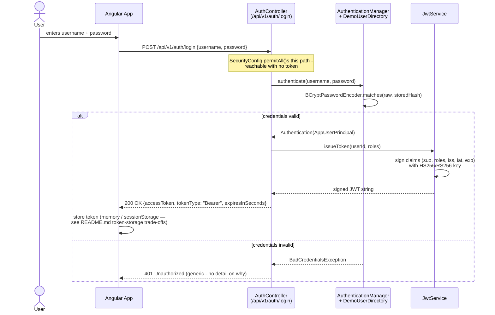

# JWT Request-Validation Flow

Two sequences: (1) obtaining a token via login, and (2) using that token on a
subsequent protected request — including both the success path and the two
main rejection paths (invalid token, insufficient role). This is the
concrete, code-level counterpart to
[oauth2-oidc-pkce-flow.md](oauth2-oidc-pkce-flow.md), which covers the
different (federated, third-party-IdP) way of obtaining a token.

## 1. Login — obtaining an access token



## 2. Using the token — protected request

```mermaid
sequenceDiagram
    actor User
    participant Angular as Angular App
    participant Filter as JwtAuthenticationFilter
    participant Jwt as JwtService
    participant Ctx as SecurityContextHolder
    participant Method as SecuredInventoryOperations<br/>(@PreAuthorize)
    participant EntryPoint as JwtAuthenticationEntryPoint

    User->>Angular: clicks "Restock SKU-123"
    Angular->>Filter: POST /api/v1/inventory/restock<br/>Authorization: Bearer &lt;token&gt;

    Filter->>Jwt: validateAndParse(token)
    alt token missing / malformed / expired / bad signature / wrong issuer
        Jwt-->>Filter: throws JwtException
        Filter->>Ctx: clearContext() (leave unauthenticated)
        Filter->>Filter: filterChain.doFilter() (continue anyway)
        Note over Filter,EntryPoint: SecurityConfig's anyRequest().authenticated()<br/>rejects the still-unauthenticated request
        EntryPoint-->>Angular: 401 Unauthorized {timestamp, status, message, path}
    else token valid
        Jwt-->>Filter: Claims {sub, roles, iss, exp, ...}
        Filter->>Filter: build AppUserPrincipal.fromJwtClaims(userId, roles)
        Filter->>Ctx: setAuthentication(UsernamePasswordAuthenticationToken)
        Filter->>Filter: filterChain.doFilter() (continue)
        Note over Ctx,Method: request reaches the controller/service layer<br/>with an authenticated SecurityContext
        Method->>Method: @PreAuthorize("hasRole('MANAGER')")<br/>evaluated against Ctx's Authentication
        alt caller has MANAGER role
            Method-->>Angular: 200 OK (restock applied)
        else caller lacks MANAGER role (e.g. CUSTOMER token)
            Method-->>Angular: 403 Forbidden (AccessDeniedException)
        end
    end
```

## Reading notes

- **Two separate concerns, two separate failure modes.** "Are you who you say
  you are" (authentication — `JwtAuthenticationFilter` + `JwtService`) and
  "are you allowed to do *this specific thing*" (authorization —
  `@PreAuthorize` in `SecuredInventoryOperations`) are deliberately different
  layers, returning different status codes (401 vs. 403) for a reason: 401
  means "come back with valid credentials," 403 means "your credentials are
  fine, but you still can't do this" — conflating them (returning 401 for a
  role mismatch, a surprisingly common bug) misleads API consumers into
  retrying with the same, still-insufficient, token.
- **No database round-trip in the second diagram.** Every check
  (`validateAndParse`, `@PreAuthorize`) is evaluated from data already inside
  the token or already in memory (`SecurityContextHolder`, request-scoped) —
  this is what "stateless" buys you operationally: any instance behind a load
  balancer handles this request identically, with no session store and no
  user-table lookup on the hot path.
- **The rejection path never reveals which check failed.** Both "no token"
  and "expired token" and "forged signature" collapse into the same generic
  401 body — see `JwtService.validateAndParse`'s Javadoc for why that's
  deliberate, not an oversight.
