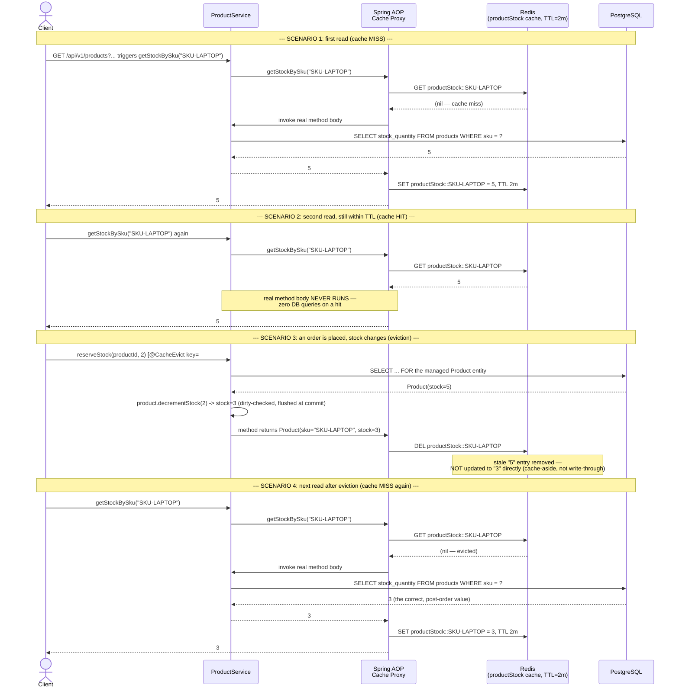

# Cache-Aside Sequence — `ProductService.getStockBySku` / mutation paths

Two scenarios in one diagram: a cache MISS followed by a cache HIT (read
path), and a mutation that evicts the entry (write path). See
`ProductService`'s Javadoc for the full cache-aside vs. write-through
discussion this diagram illustrates.

## Why this is "cache-aside" and not "write-through"

The mutation path (Scenario 3) never writes the new value (`3`) into
Redis directly — it only **deletes** the stale entry. The cache is
repopulated lazily, as a side effect of the next read that happens to miss
(Scenario 4). This is the defining trait of cache-aside: the cache is
always populated *by a read*, never *by a write*. See
`ProductService`'s Javadoc and `README.md`'s Caching section for why this
module chose that over write-through, and for the TTL trade-off (why 2
minutes, not 2 seconds or 2 hours) and the "two hard things in computer
science" framing for cache invalidation.
