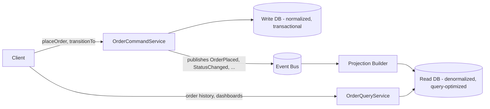
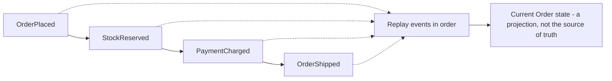
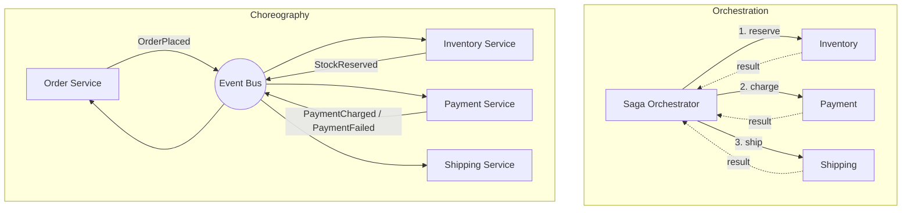
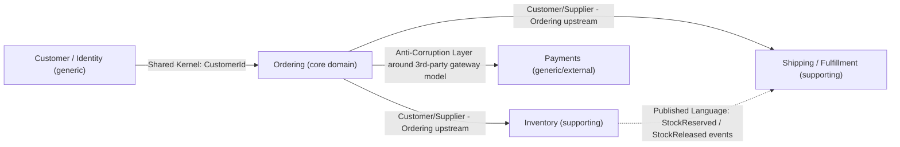
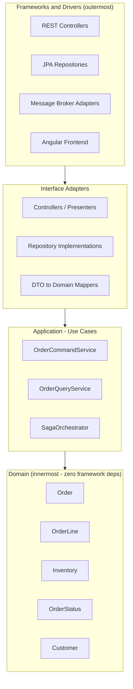

# Module 13 — System Design (HLD/LLD, Scalability, Distributed Patterns)

**Domain used throughout:** the same Order/Inventory system from every earlier module — but this module is where it stops being "a program" and becomes "a distributed system." Module 1 ([java-basics/](../java-basics/)) built `OrderService.placeOrder()` as one process, one in-memory `Inventory`, one manual rollback loop. This module asks the question a senior system-design interview always asks next: **what happens to this design when it has to run on more than one machine, survive a data-center outage, and serve Black-Friday-level traffic?** Every pattern below is introduced by first showing where the Module 1 design breaks, then showing the distributed-systems fix and its cost.

Companion files:
- [diagrams/hld-microservices.md](diagrams/hld-microservices.md) — HLD of the microservices split with an API Gateway
- [diagrams/saga-happy-path.md](diagrams/saga-happy-path.md) — Saga sequence diagram, happy path
- [diagrams/saga-compensation-path.md](diagrams/saga-compensation-path.md) — Saga sequence diagram, failure + compensation path
- [diagrams/ddd-context-map.md](diagrams/ddd-context-map.md) — DDD bounded-context map
- [diagrams/clean-architecture-layers.md](diagrams/clean-architecture-layers.md) — clean/hexagonal architecture layering
- [lld/saga-orchestrator.md](lld/saga-orchestrator.md) + [lld/src/](lld/src/) — deep LLD of the Saga Orchestrator, with an illustrative (not-compiled-here) Java skeleton
- [mock-interview.md](mock-interview.md) — full mock system-design interview transcript
- [EXPLANATION.md](EXPLANATION.md) — walkthrough of the LLD skeleton and the diagrams' reasoning
- [EXERCISES.md](EXERCISES.md) — hands-on / scenario exercises
- [INTERVIEW.md](INTERVIEW.md) — beginner/intermediate/senior/scenario interview questions with ideal answers

**Note on scope boundaries with sibling modules:** this module is architecture and trade-off analysis, not a second implementation of AWS or Spring mechanics. Where relevant it points at *where* the mechanics live — e.g. "the `aws/` module's Step Functions section covers the AWS-native way to implement the orchestrator described here," or "the `spring/` module's Spring Cache coverage is the concrete Java API for the cache-invalidation strategy discussed below" — without depending on or restating their content.

---

## 1. Scalability Fundamentals: Vertical vs. Horizontal Scaling, Statelessness

### What it is
**Vertical scaling** ("scale up") means giving one instance more CPU/RAM/disk. **Horizontal scaling** ("scale out") means running more instances of the same service behind a load balancer. **Stateless service design** means no instance holds request-specific or session-specific data in its own memory between requests — any instance can handle any request, because the state that matters lives somewhere shared (a database, a distributed cache, a token), not in a `private Map` inside the service process.

### Why introduced / problem it solves
A single, ever-bigger machine has a hard ceiling (there's a biggest instance you can rent) and a hard failure mode (that one machine dies, everything is down). Horizontal scaling removes both ceilings — add more commodity instances, and losing one doesn't take the whole system down — but it only works if any request can land on any instance and get a correct answer.

### The concrete break: Module 1's `Inventory` cannot scale horizontally as written
Look at `java-basics`' `Inventory`:
```java
private final Map<String, Integer> stockBySku = new HashMap<>();
```
This is **in-process, in-memory state**. Run two instances of `OrderService` behind a load balancer, each with its own `Inventory` object, and you get two independent, diverging views of stock: instance A thinks SKU `WIDGET-1` has 40 units left, instance B thinks it has 55, because each only sees the reservations *it personally* processed. Round-robin ten requests for the last 10 units across two instances and you can oversell — the exact bug `Inventory.reserve()`'s single-process invariant ("stock never negative") was designed to prevent, reintroduced at the fleet level because the invariant lived in the wrong place (an instance's heap) to survive having more than one instance.

The fix every real deployment makes: push that state out of the process and into something all instances share — a database (this is what `database/`'s and `spring/`'s Spring Data JPA coverage does: `Inventory` becomes a table, not a `HashMap`) or a distributed cache/store (Redis, DynamoDB) with atomic operations. Once stock lives in shared, atomically-updated storage, any instance can serve any request and see the same truth. **Statelessness isn't a nice-to-have property of the service — it's the prerequisite that makes horizontal scaling correct instead of just "technically running on more machines."**

### When to use which
- **Vertical scaling first**, almost always: it's zero application changes, and modern hardware ceilings are high (hundreds of GB RAM, dozens of cores). Reach for it when a single service is under-provisioned relative to a *ceiling* you haven't hit yet.
- **Horizontal scaling** once you need: (a) throughput beyond what one machine can serve regardless of size, (b) availability that survives one machine's failure, or (c) the ability to scale down cheaply during off-peak (elasticity) — none of which vertical scaling alone gives you.
- Sticky sessions (routing a client to the "same" instance repeatedly) are a stopgap, not a fix — they reintroduce a soft dependency on one instance and complicate load-balancer failover. Prefer genuinely stateless instances plus externalized session/cart state.

### Trade-offs & performance implications
- Horizontal scaling trades simplicity for elasticity and resilience: you now pay for a load balancer, service discovery, and the latency of every stateful lookup going over the network to shared storage instead of an in-process field access (nanoseconds vs. sub-millisecond-to-milliseconds).
- Vertical scaling has a cost curve that isn't linear — the biggest instances carry a steep price premium per unit of compute, and you still have a single point of failure no amount of vertical scaling removes.
- Externalizing state (the `Inventory` fix above) adds a network hop and a new failure mode (the shared store becomes a dependency every instance needs) — this is the seed of the CAP discussion in the next section.

### Enterprise examples
- Amazon.com famously scales the checkout/inventory path horizontally across many stateless fleet instances backed by DynamoDB — no instance "remembers" stock; every request reads/writes the shared store.
- A common real migration: a monolith that started as one large vertically-scaled instance with an in-memory cart eventually moves cart state to Redis specifically to unblock horizontal scaling for a peak-traffic event (e.g. a flash sale).

### Common mistakes
- Adding more instances behind a load balancer without removing in-memory state first — this doesn't scale throughput, it scales the number of divergent, wrong answers.
- Assuming "stateless" means "no state exists" rather than "state lives outside this process's memory."
- Treating horizontal scaling as free once statelessness is achieved — every added instance also adds load on the shared store, which needs its own scaling strategy (covered in Section 3).

---

## 2. CAP Theorem and PACELC

### What it is
**CAP** says a distributed data store can only guarantee two of three properties *during a network partition*: **C**onsistency (every read sees the latest write), **A**vailability (every request gets a non-error response), **P**artition tolerance (the system keeps working despite dropped/delayed messages between nodes). Because partitions *will* happen in any real network, P is not really optional — CAP in practice is a choice between **CP** (consistent but may refuse requests during a partition) and **AP** (available but may return stale data during a partition).

**PACELC** extends this: **if Partitioned**, choose **A**vailability or **C**onsistency (that's CAP) — **Else** (the normal, non-partitioned case), choose **L**atency or **C**onsistency. This matters because CAP alone only describes the rare partition case; PACELC forces you to also decide your trade-off for the *common* case, where the real day-to-day cost of strong consistency is added latency (waiting for a quorum/replica acknowledgment), not availability.

### Applying it concretely to this system: stock count vs. product description
Suppose Inventory's stock count is replicated/sharded across regions for global scale (the natural next step after Section 1's "push state into shared storage" — now that shared store itself needs to scale globally). Two different pieces of data in the *same* system warrant *different* answers:

- **Stock count for a specific SKU during checkout → choose consistency (CP).** Overselling (two customers in different regions both "successfully" buy the last unit because each read a stale, higher count) is a business incident: refunds, apology emails, damaged trust, and in some jurisdictions a legal obligation to honor the sale anyway at a loss. The cost of choosing C is that a checkout request might briefly fail or block (an honest "try again," or route to the primary region) during a partition or while waiting for a quorum write — worse UX for a moment, but never a wrong answer. In PACELC terms: even absent a partition, accept the extra latency of a strongly-consistent read/write (e.g. reading from the primary/leader, or requiring a write quorum) rather than reading a cached/replica value that might be stale.
- **Product description / marketing copy → choose availability (AP).** Serving a slightly-stale product description (an old price copy update, an old image URL) for a few seconds is a non-event. Here, PACELC's "else" branch clearly favors **latency**: serve from the nearest read replica or edge cache, accept eventual consistency, and never make a page-render block on a cross-region consistency check.

This is exactly the kind of question interviewers ask specifically to see whether a candidate treats CAP as a system-wide constant ("we're an AP system") versus a per-data-type decision — the senior answer is "it depends on what the data represents and what an error costs versus what staleness costs," illustrated with a concrete example like stock count vs. description, not a rule recited in the abstract.

### When to use CP vs. AP more generally
- **CP**: financial balances, inventory/stock counts, seat/ticket allocation, anything where two conflicting "successful" writes are a correctness violation, not just a UX blemish.
- **AP**: read-heavy, tolerant-of-staleness data — catalogs, search indexes, view/like counters, recommendation feeds, most GET-heavy dashboards.

### Trade-offs & performance implications
- CP systems pay latency and, during a real partition, availability — a minority-side partition may have to refuse writes (or reads, depending on design) to avoid serving/accepting an inconsistent value.
- AP systems must have a conflict-resolution story for when replicas disagree after a partition heals (last-write-wins by timestamp, vector clocks, or application-level reconciliation) — "available" doesn't mean "the reconciliation problem goes away," it means it's deferred.
- PACELC's "else" branch is where most of the day-to-day cost actually lives in practice — partitions are relatively rare events; the latency-vs-consistency trade-off during normal operation is paid on every single request.

### Enterprise examples
- DynamoDB is tunable per-request (`ConsistentRead=true` for strong consistency at higher latency/cost, or eventually-consistent reads by default for lower latency/cost) — a direct, productized version of the PACELC choice.
- Banking core systems (ledger balances) are CP by necessity; CDNs serving static assets are AP by design — nobody wants a CDN edge node refusing to serve a cached image because it can't confirm consistency with origin.

### Common mistakes
- Saying "CAP means you can only have two of three" without acknowledging P isn't really a choice in a real network — the actual choice is CP vs. AP.
- Applying one CAP/PACELC answer to an entire system instead of reasoning per data type (stock count vs. description above).
- Forgetting PACELC's "else" branch and only discussing the partition case, missing that the latency/consistency trade-off is paid continuously, not just during rare partitions.

---

## 3. Caching, Replication, Sharding

### What it is
- **Read replicas**: copies of a primary database that serve read traffic, kept in sync via (usually asynchronous) replication, offloading read load from the primary and improving read latency for geographically distant clients.
- **Sharding**: splitting one logical dataset across multiple physical databases by a partition key, so no single database instance has to hold or serve the entire dataset.
- **Caching**: storing a computed or frequently-read value somewhere faster/closer than its source of truth, at the cost of it becoming potentially stale.

### Applying it to the orders system
- **Read replicas for the orders DB**: order-history queries ("show me my last 50 orders," dashboards, reporting) are read-heavy and tolerant of being a few seconds stale — route them to a read replica. Writes (`placeOrder`, `transitionTo`) always go to the primary, since they need immediate consistency for the requesting user (a customer who just placed an order must see it appear in their history right away — a classic **read-your-own-writes** requirement that plain replica routing can violate if the replica hasn't caught up yet; a common fix is routing that specific customer's next few reads to the primary for a short window, or reading their own recent writes from a short-lived cache written at write time).
- **Sharding orders at scale**: once order volume outgrows a single database's capacity, shard by `customer_id` (keeps one customer's order history on one shard — most order-history queries are per-customer, so this avoids scatter-gather across shards) or by region (keeps data close to where it's generated/queried and can satisfy data-residency requirements). The trade-off: cross-shard queries (e.g. "total orders placed today across all customers") become expensive scatter-gather-and-merge operations instead of one query — this is usually solved by *not* running that query against the sharded write store at all, but against a purpose-built read model (see Section 4, CQRS).
- **Cache invalidation for product/inventory data**: cache product catalog reads (descriptions, prices) aggressively with a TTL, since staleness there is cheap (Section 2). Cache stock *counts* far more cautiously if at all for anything feeding a checkout decision — either a very short TTL, or cache-aside with active invalidation on every `reserve()`/`release()` write (publish an invalidation event or directly evict the cache key in the same transaction/outbox as the stock write). The `spring/` module's Spring Cache coverage (`@Cacheable`/`@CacheEvict`, Redis-backed caches, TTL configuration) is the concrete Java implementation of this same strategy — this module focuses on *which* data gets which strategy and why, not the annotation-level mechanics.

### When to use / when NOT to use
- Use read replicas when read:write ratio is high (order history reads vastly outnumber order placements) and a few seconds of replication lag is acceptable for that specific read path.
- Don't route a write-then-immediately-read-own-write flow through a replica without a read-your-own-writes mitigation — it's a very common source of "I just placed an order and it's not showing up" bug reports.
- Shard only once a single database instance is provably the bottleneck (connection limits, storage limits, write throughput) — sharding adds substantial operational and query complexity (resharding is hard, cross-shard transactions are hard-to-impossible) and should not be reached for preemptively.
- Cache aggressively for read-heavy, staleness-tolerant data; avoid caching anything that gates an irreversible action (charging a card, confirming the last unit of stock) without a correctness-preserving invalidation strategy.

### Trade-offs & performance implications
- Replication lag is the fundamental cost of read replicas — under load or after a burst of writes, replicas can fall meaningfully behind, and "eventually consistent" reads become "how eventually?" in an incident review.
- Sharding turns some previously-trivial queries (global aggregates, uniqueness constraints across the whole dataset) into hard distributed problems — a unique email constraint, for instance, can't be enforced by the database alone once customers are sharded by region unless the shard key *is* (or includes) the uniqueness key.
- Cache invalidation is famously one of the two hard problems in computer science for a reason: a missed invalidation shows stale data indefinitely; an overly aggressive invalidation strategy erases the performance benefit of caching in the first place.

### Enterprise examples
- Read replicas for reporting/analytics workloads isolated from the primary transactional database is close to universal practice at any company running Postgres/Oracle at scale (see `database/` module).
- Large e-commerce platforms shard orders by customer or account ID specifically so a customer's full order history is a single-shard query.

### Common mistakes
- Sending all reads to replicas indiscriminately, including the read-your-own-writes path, and then debugging a confusing "missing data" ticket that's actually just replication lag.
- Choosing a shard key based on what's easiest to implement rather than the actual query/access pattern (e.g. sharding by `order_id` when almost every query is "orders for customer X" — that shard key forces scatter-gather on the common case).
- Treating a cache as a second source of truth instead of a disposable, rebuildable-from-source performance optimization — if losing the cache entirely would be a correctness incident rather than a performance regression, something is designed wrong.

---

## 4. CQRS (Command Query Responsibility Segregation)

### What it is
Splitting the model (and often the data store) used for **writes** (commands: `placeOrder`, `transitionTo`) from the model used for **reads** (queries: order history, dashboards, "orders needing attention"). `OrderCommandService` owns the write path and enforces invariants (stock availability, legal status transitions); `OrderQueryService` serves reads from a model — potentially a different database entirely — optimized for how the data is actually queried, not how it's transactionally written.

### Why introduced / problem it solves
A single model optimized for transactional correctness (normalized tables, one row per order/line, strict constraints) is frequently a bad fit for read patterns (a dashboard wants pre-aggregated, denormalized, join-free data for speed). Forcing one model to serve both pulls it in opposite directions: normalize for write integrity vs. denormalize for read speed. CQRS resolves the tension by not requiring one model to do both jobs.



### When to use / when NOT to use
- Use CQRS when read and write patterns/scale genuinely diverge — heavy reporting/dashboard load on an OLTP-shaped write model, or read models that need a fundamentally different shape (search-indexed, pre-joined, pre-aggregated) than the transactional schema.
- **Don't** default to CQRS for a simple CRUD service with modest, symmetric read/write load — it adds a second data model, a synchronization mechanism (Section 5's events are the natural fit), and an eventual-consistency window between write and read-model-catches-up that a single-model CRUD service simply doesn't have to reason about. This is over-engineering for a system that doesn't have the read/write divergence problem yet.

### Trade-offs & performance implications
- The read model is eventually consistent with the write model — the projection lag (usually milliseconds to low seconds if event-driven) means "I just placed an order" might not instantly appear in a read-model-backed history view. Needs the same read-your-own-writes mitigation discussed in Section 3, or a UI pattern that optimistically shows the just-submitted order client-side while the read model catches up.
- Two models means two things to keep in sync, two schemas to migrate, and a projection/synchronization pipeline that is itself a new operational component (a new thing that can lag, fail, or need replaying).
- Read-side performance gains can be substantial — a purpose-built read schema can turn a multi-join, multi-second dashboard query into a single-table sub-100ms lookup.

### Enterprise examples
- Order-management and e-commerce platforms commonly run a normalized transactional order store for placement/fulfillment and a separate search/analytics-optimized store (e.g. Elasticsearch, a data warehouse, or a denormalized read replica schema) for order-history search and dashboards.

### Common mistakes
- Implementing CQRS but keeping a synchronous, request-blocking path from command to read-model update — that reintroduces the tight coupling and latency CQRS was meant to remove, without gaining any of the read-model flexibility.
- Assuming CQRS requires Event Sourcing (Section 5) — they're complementary and often paired, but CQRS is valid on its own with a normal command-then-update-projection flow; Event Sourcing is a specific way to build and rebuild the write and/or read models from an event log.

---

## 5. Event Sourcing

### What it is
Instead of storing an `Order`'s *current* state (as Module 1's `Order` class does — one row, mutated in place by `transitionTo`), store the full sequence of events that happened to it: `OrderPlaced`, `StockReserved`, `PaymentCharged`, `OrderShipped`, `OrderCancelled`. Current state is derived by replaying events in order — it's a projection of the log, not the primary record.



### Why introduced / problem it solves
A state-only model answers "what is true now" but discards "what happened and when/why" — the moment someone asks "why does this order show CONFIRMED but the customer says they cancelled it," a state-only system has no record beyond whatever an audit-log side-table happened to capture. Event Sourcing makes the full history the *primary* artifact: the audit trail isn't a bolted-on feature, it's a structural side effect of how data is stored.

### When to use / when NOT to use
- Use it where auditability, "as-of" queries ("what did this order look like at 3pm yesterday"), or reconstructing/debugging complex state transitions has real business or compliance value — this is common in financial and order/fulfillment systems for exactly that reason (dispute resolution: "prove what happened, in order, with timestamps").
- **Don't** use it for simple entities with no meaningful history requirement and no need to replay/reconstruct past states — it adds real query complexity (below) that isn't worth paying for a settings toggle or a user's display-name field.

### Trade-offs & performance implications
- **Audit trail "for free"**: every state change is inherently timestamped, ordered, and attributable — a strong win for compliance-heavy domains (finance is exactly this repo's inspiration domain: JPMorgan/Goldman-style systems care a great deal about "prove what happened when").
- **Query complexity**: "what's the current stock-reserved status of order X" now requires either replaying every event for that order (fine for a single order, expensive at scale) or maintaining a **snapshot** (periodic materialized current-state checkpoint, so replay only needs to process events since the last snapshot) or a CQRS read-model projection (Section 4) kept up to date as new events arrive — in practice, Event Sourcing and CQRS are used together for exactly this reason.
- **Eventual consistency of projections**: any read model built by replaying/projecting events is, by construction, built asynchronously from the append-only event log — the same read-your-own-writes caveat from Sections 3 and 4 applies here too.
- Event schema evolution is a real, ongoing cost: events are immutable and kept forever, so a field you got wrong in `OrderPlaced`'s shape two years ago is still in the log — you version events and write upcasting/migration logic in the projector, you don't rewrite history.

### Enterprise examples
- Banking ledgers are conceptually event-sourced by nature (a balance is a projection of all debits/credits, never directly mutated) — this is the oldest real-world instance of the pattern, predating the term.
- Order-management systems that need to answer "replay this order's exact history for a customer service dispute" without a bolted-on audit log.

### Common mistakes
- Treating the projected "current state" as if it were still the source of truth and mutating it directly — that silently breaks the event log's status as ground truth and makes future replays produce a different answer than what's live.
- Underestimating snapshot/replay-performance planning — a naive "replay every event from the beginning" strategy degrades linearly as an entity accumulates years of history.
- Storing events with implementation-detail-shaped fields instead of business-meaningful fields, making later schema evolution and cross-service consumption harder than it needs to be.

---

## 6. Saga Pattern — the centerpiece of this module

### The direct generalization from Module 1
Re-read `java-basics`' `OrderService.placeOrder()`:
```java
public Order placeOrder(Customer customer, List<OrderLine> requestedLines) {
    Deque<OrderLine> reserved = new ArrayDeque<>();
    try {
        for (OrderLine line : requestedLines) {
            inventory.reserve(line.product().sku(), line.quantity());
            reserved.push(line);
        }
    } catch (InsufficientStockException e) {
        for (OrderLine line : reserved) {
            inventory.release(line.product().sku(), line.quantity());
        }
        throw e;
    }
    ...
}
```
This is already a saga in miniature: a sequence of steps against one collaborator (`Inventory`), each step remembered on success, and a compensating action (`release`) run in reverse order if a later step fails. It works because everything is **one process, one thread of control, one in-memory collaborator** — there's no possibility of the "reserve succeeded but the confirmation was lost" ambiguity that shows up the moment `Inventory` becomes a separate service reachable only over a network.

**The Saga pattern is exactly this same shape, generalized across separate, independently-deployable services (Order, Inventory, Payment, Shipping) that have no shared database and therefore no shared ACID transaction to lean on.** Where Module 1 had one `try`/`catch`/rollback-loop, a distributed saga needs: a place to track which steps completed (because "list of completed steps" can no longer safely live as a local variable that vanishes if the process crashes mid-saga), a compensating action per step that is safe to invoke against a remote service (and must be **idempotent**, because network retries mean a compensation might be triggered more than once), and a decision about *who* is responsible for knowing "what's next": a central coordinator, or the services themselves reacting to each other's events.

### Orchestration vs. Choreography

**Orchestration**: a central **Saga Orchestrator** explicitly calls each service in sequence and explicitly invokes compensations on failure. This repo's [lld/saga-orchestrator.md](lld/saga-orchestrator.md) implements this style; the `aws/` module's Step Functions coverage is the AWS-native way to run this same orchestrator as a managed state machine instead of custom code.

**Choreography**: there is no central coordinator — each service publishes an event when it finishes its part, and the next service(s) react to that event. `OrderService` publishes `OrderPlaced`; `InventoryService` listens for it, reserves stock, and publishes `StockReserved` (or `StockReservationFailed`); `PaymentService` listens for `StockReserved` and reacts, and so on, with each service also responsible for listening for downstream failure events and running its own compensation.



| | Orchestration | Choreography |
|---|---|---|
| Where's the logic? | Centralized in one orchestrator — read the saga flow in one place | Distributed across every service's event handlers — no single place shows the whole flow |
| Coupling | Orchestrator knows about every participant (coupling *to* the orchestrator, not between services) | Services are coupled to event *contracts*, not to each other directly — lower direct coupling |
| Debuggability | Easier — one component's logs/state show saga progress | Harder — reconstructing "what happened to order X" means correlating events across N services' logs (this is exactly why Section 12's distributed tracing matters more, not less, for choreography) |
| Adding a new step | Change the orchestrator | Add a new listener for the relevant event — existing services often need zero changes |
| Failure mode | Orchestrator itself is a new single point of coordination — it must be made highly available and its state durable/recoverable after a crash | No single coordinator to lose, but a "sequence of events fired out of order or one got dropped" bug can be substantially harder to detect and fix |
| Good fit | Complex flows with many steps/conditional branches, or where the business wants one auditable place to see saga state (dashboards, ops runbooks) | Simple flows with few participants, or organizations where each service team wants full autonomy over their own reaction logic without depending on a shared orchestrator component |

**This repo's LLD ([lld/saga-orchestrator.md](lld/saga-orchestrator.md)) implements orchestration** because it maps most directly and most teachably onto Module 1's existing `try`/`catch`/rollback shape, and because it's the style most senior interviews ask candidates to design and reason about (a whiteboard sequence diagram of an orchestrator is easier to produce under interview time pressure than a fully worked choreography event-flow, and interviewers usually want to see whether you *know both exist and can justify picking one*).

### Compensating transactions, step by step
For the order-placement saga (`CreateOrder → ReserveInventory → ChargePayment → ArrangeShipping → ConfirmOrder`):

| Step | Forward action | Compensation | When compensation runs |
|---|---|---|---|
| CreateOrder | Create `Order` in `PENDING` | Transition order to `CANCELLED` | Any later step fails |
| ReserveInventory | Reserve stock for every line | `ReleaseInventory` — release the same reservation | `ChargePayment` or a later step fails |
| ChargePayment | Charge the customer's payment method | `RefundPayment` — refund the exact charge | `ArrangeShipping` or a later step fails |
| ArrangeShipping | Schedule a shipment | `CancelShipment` | `ConfirmOrder` fails (rare — shown for completeness) |
| ConfirmOrder | Transition order to `CONFIRMED` | (terminal step — nothing after it to compensate for) | n/a |

See [diagrams/saga-happy-path.md](diagrams/saga-happy-path.md) and [diagrams/saga-compensation-path.md](diagrams/saga-compensation-path.md) for the full sequence diagrams, and [lld/saga-orchestrator.md](lld/saga-orchestrator.md) for the class design and Java skeleton implementing exactly this flow.

### When to use / when NOT to use
- Use a saga whenever a single logical business operation spans more than one service/database and needs an "all-or-nothing" outcome without a distributed ACID transaction (two-phase commit) being available or acceptable (2PC exists but is rarely used in practice at scale — it requires all participants to be available and blocks on the slowest one, which is a poor fit for independently-deployed, independently-scaled services).
- **Don't** reach for a saga inside a single service/single database boundary — that's just a local transaction (`@Transactional`, covered in `spring/`), and reimplementing saga machinery there is pure overhead for a problem a database transaction already solves for free.

### Trade-offs & performance implications
- Sagas trade atomicity for availability and service independence: there is a real window where the system is in a partially-completed state (order created, stock reserved, payment not yet charged) that other reads might observe — application code (and UI) must be designed to tolerate and clearly represent "in progress" states, not assume every read sees a fully-committed-or-fully-rolled-back world.
- Compensations are not free "undo" — `RefundPayment` is a real, sometimes fee-bearing operation, not a database rollback; some forward actions (an email already sent, a shipment already physically dispatched) may not be perfectly compensable at all, which is a real business-process design question, not just a technical one.
- Every step and compensation must be designed **idempotent** — network retries mean "charge the customer" or "release the stock" might be invoked more than once for the same saga instance, and a non-idempotent implementation double-charges or double-releases.

### Enterprise examples
- Uber's trip-lifecycle and payment-settlement systems are commonly cited real-world sagas (driver-matching, fare calculation, payment capture, each independently owned and each with a defined compensation).
- Any e-commerce checkout that touches a third-party payment gateway, a separate fulfillment/warehouse system, and a separate notifications service is architecturally a saga whether or not the team calls it one by name.

### Common mistakes
- Forgetting to make compensations idempotent, then discovering it in production when a retry double-refunds a customer.
- Running compensations in forward order instead of reverse — undoing an earlier step while a later step still assumes it succeeded can leave the system in a worse, inconsistent state than doing nothing.
- Treating the orchestrator as stateless/ephemeral — if it doesn't durably persist "which step this saga instance is on," a crash mid-saga loses track of in-flight work, which then never gets compensated or completed (an orphaned, half-done order, silently stuck forever).

---

## 7. Circuit Breaker, Retries, Rate Limiting

### What it is
- **Circuit breaker**: a stateful guard around a remote call. **Closed** (normal — calls pass through, failures counted). Once failures cross a threshold, it **opens** (calls fail immediately, without even attempting the network call, for a cool-down period) — protecting both the caller (fast failure instead of hanging on a doomed call) and the struggling downstream service (no pile of retries adding load to something already failing). After the cool-down, it goes **half-open** (lets a small number of trial calls through) — success closes the circuit again, failure re-opens it.
- **Retries with exponential backoff and jitter**: on a transient failure, retry after a delay that grows exponentially (1s, 2s, 4s, 8s...) with a randomized jitter added, instead of retrying immediately or at a fixed interval.
- **Rate limiting**: capping how many requests a client (or the system as a whole) can make in a time window, rejecting or queuing the excess.

### Applying it: Order service calling Payment/Inventory
`ChargePaymentStep` and `ReserveInventoryStep` (Section 6) both make network calls to services that can be slow, down, or degraded. Without a circuit breaker, a struggling Payment service causes every `placeOrder` call to hang for the full timeout, exhausting the Order service's own thread/connection pool and taking *it* down too — a cascading failure, the single most common way one struggling service takes down an otherwise-healthy one.

Resilience4j-style configuration concepts (the concrete Java library — used here to name the concepts, not to write a full config):
- **Failure-rate threshold** (e.g. open the circuit once 50% of calls in a rolling window of the last 20 calls fail).
- **Wait duration in open state** (e.g. 30 seconds before allowing a half-open trial).
- **Half-open trial call count** (e.g. allow 5 calls through in half-open state before deciding to fully close or re-open).
- **Slow-call threshold** — treating a call that *succeeds* but takes too long as a failure for circuit-breaking purposes, not just outright errors (a hung dependency is often worse than an erroring one).

### Why jitter matters — the thundering herd problem
If every failed client retries at exactly 1s, 2s, 4s, 8s with no randomization, and a downstream outage caused thousands of clients to fail simultaneously, all those clients retry **in synchronized waves** — each wave hits the recovering service at the exact same instant, at increasing severity as more clients pile into later waves, potentially preventing the service from ever recovering (it looks "up" for a split second, gets hit by a synchronized wave, falls back over). Adding jitter (a random offset within each backoff window, e.g. "wait between 0.5x and 1.5x the computed backoff") spreads retries out in time, turning a synchronized thundering herd into a smooth, absorbable trickle.

### Rate limiting at the API Gateway
Rate limiting belongs at the edge (the API Gateway, Section 8) specifically to protect backend services from abusive or simply buggy/runaway clients *before* that load reaches internal services at all — a misbehaving client hammering `/orders` shouldn't be able to consume capacity that legitimate traffic needs, and it's far cheaper to reject at the gateway than to let the request travel all the way to the Order service, the Saga Orchestrator, and three downstream calls before being rejected.

### When to use / when NOT to use
- Circuit breakers: use around every network call to a dependency that can degrade independently of your own service — essentially every cross-service call in a microservices architecture. Don't bother for in-process calls (there's nothing to "trip" — a slow method call inside the same process isn't a network dependency).
- Retries: use for genuinely transient failures (network blip, momentary overload, a 503). **Don't** retry non-idempotent operations without an idempotency key, and don't retry a 4xx client error (retrying "insufficient stock" or "invalid request" endlessly just wastes calls on a failure that won't change).
- Rate limiting: apply per-client (API key/token) limits at the gateway for fairness and abuse protection; apply a separate, coarser global limit to protect the whole backend from an aggregate spike even if no single client is individually over its limit.

### Trade-offs & performance implications
- A circuit breaker trades a small number of "fails fast even though the dependency might have actually recovered" false positives (during the open/cool-down window) for a much larger win: preventing cascading failure and giving a struggling dependency room to recover instead of being retried into the ground.
- Exponential backoff with jitter adds latency to the failure path specifically to reduce total system-wide load — a deliberate trade of "this one caller waits a bit longer" for "the dependency doesn't get thundering-herded back into failure."
- Rate limiting at the gateway protects the backend but can reject legitimate traffic during genuine, organic spikes (a real Black-Friday surge, not abuse) if limits are static — production systems often pair static limits with autoscaling and/or a request queue rather than a hard reject for expected-but-large legitimate traffic.

### Enterprise examples
- Netflix's Hystrix (the original popularizer of the circuit-breaker pattern at scale, now largely superseded by Resilience4j in the Java ecosystem) was built specifically because one slow dependency among hundreds of microservices could otherwise cascade into a full-platform outage.
- API gateways at companies like Stripe and most major cloud API providers publish explicit per-key rate limits precisely to protect shared backend capacity from any single integrator.

### Common mistakes
- Retrying without a cap on total attempts or total elapsed time — an unbounded retry loop against a genuinely down dependency just delays failure while burning resources.
- Setting circuit breaker thresholds so sensitive that normal, brief latency blips trip it constantly (a "flapping" circuit), or so loose that it never trips before the caller's own resources are exhausted.
- Applying rate limits only globally and not per-client, letting one runaway or abusive client consume the entire shared budget.

---

## 8. API Gateway

### What it is
A single entry point that sits in front of a set of backend services, handling cross-cutting concerns once instead of duplicating them in every service: request routing (path/host-based routing to the right backend), authentication/authorization termination, rate limiting (Section 7), request/response transformation, and **aggregation** (combining multiple backend calls into one response for a client that shouldn't need to know the backend is split into several services).

### Applying it here
A mobile client rendering an order-confirmation screen might need: the order itself (Order service), the customer's loyalty points balance (Customer service), and estimated delivery date (Shipping service). Without a gateway, the client makes three separate calls (three round-trips, three failure points, three sets of auth headers to manage). With a gateway performing **aggregation**, the client makes one call; the gateway fans out to the three backend services internally and composes one response.

- **Auth termination**: the gateway validates the JWT/OAuth2 token once (conceptually, the mechanics of that validation are the `security/` module's territory) and forwards a trusted, already-validated identity to backend services — those services don't each need to independently implement full token validation, though they should still enforce their own authorization rules on that trusted identity (defense in depth, not blind trust of an internal network).
- **Routing**: `/orders/**` → Order service, `/inventory/**` → Inventory service, etc. — the client only ever knows one hostname.

### When to use / when NOT to use
- Use an API Gateway as soon as there's more than one backend service that external clients talk to — even two services benefit from one entry point instead of clients needing to know both addresses and duplicate cross-cutting concerns against both.
- Don't let the gateway accumulate *business logic* (e.g. saga orchestration itself, or complex conditional routing based on order contents) — that recreates a monolith inside the "thin" layer that was supposed to stay thin, and couples an infrastructure component to domain logic that changes far more often than routing/auth rules should.

### Trade-offs & performance implications
- A gateway is a new single point of failure and a new latency hop for every request — it must itself be deployed highly-available (multiple instances behind its own load balancer) or it becomes the very outage risk it was meant to shield backend services from.
- Aggregation at the gateway trades client-side simplicity for gateway-side complexity and a new coupling: the gateway now needs to know the shape of multiple backend responses, and a backend response-shape change can require a gateway change too.

### Enterprise examples
- Amazon API Gateway (the AWS product — see the `aws/` module) and Netflix's Zuul/Spring Cloud Gateway are the standard implementations of exactly this pattern in front of microservices.

### Common mistakes
- Putting saga orchestration or other deep business logic in the gateway layer "because it's already touching every request" — that's a layering violation; the gateway routes and terminates cross-cutting concerns, it doesn't own business workflows.
- Single-instance gateway deployments that become the actual bottleneck/SPOF the pattern was meant to avoid.

---

## 9. Microservices vs. Modular Monolith — the recommendation for THIS system

### The senior-level answer: don't default to microservices
For an order-management system at a **plausible mid-size company scale** (a company with, say, a few hundred engineers total, a handful of teams that would own pieces of this domain, and order volume in the thousands-to-low-millions per day rather than Amazon-scale), **the recommendation is to start as a well-structured modular monolith with clear bounded-context boundaries (Section 10), and split out a service only when a genuine scaling or team-ownership need actually materializes.**

### Why not microservices-by-default
Splitting `Order`, `Inventory`, `Payment`, and `Shipping` into four separately-deployed services from day one buys, immediately, on day one, before there's any actual need: network calls (and their latency, and their new failure modes) where a method call used to be; the full Saga-pattern machinery of Section 6 to replace a database transaction that a modular monolith gets for free; four separate deployment pipelines, four separate on-call rotations, four services' worth of observability (Section 12) to correlate instead of one process's logs; and a much higher cost of getting a bounded-context boundary *wrong* — a boundary mistake in a monolith is a package/class refactor; the same mistake across services is a distributed-system migration involving live data and a compatibility period.

None of this is hypothetical caution — it is Conway's Law and the well-documented experience of numerous companies (widely discussed as the "premature microservices" anti-pattern) that split into microservices before they had the team structure, traffic, or organizational scaling need to justify the cost, and spent significant effort either maintaining unnecessary distributed-systems complexity or re-consolidating services back together.

### The modular monolith, concretely
One deployable application, internally organized into modules that mirror the bounded contexts from Section 10 (`ordering`, `inventory`, `payments`, `shipping`, `customer`) with **enforced** boundaries — each module exposes a narrow public interface (an application-service-layer API, not direct access to another module's internal classes/tables), so that the *shape* of a future service split already exists in the code even though it's one process today. Java-level enforcement of this (package-private classes, module boundaries, or even physically separate Maven modules within one deployable) is exactly what makes a later extraction tractable instead of a rewrite.

### When splitting out a real service *is* justified
- **Genuine independent scaling need**: Payment processing has fundamentally different traffic/latency/compliance characteristics than order placement and needs to scale (or be isolated for PCI compliance reasons) independently.
- **Genuine team-ownership need**: a dedicated team forms around Shipping/Fulfillment with its own roadmap, release cadence, and on-call needs that no longer fit sharing a deployment pipeline with the rest of the monolith.
- **Technology divergence**: a component needs a different runtime/language/datastore than the rest of the system for a real technical reason (e.g. a recommendation engine needing a specialized ML serving stack) — not "the new team just prefers Node."

When one of these becomes true for one specific bounded context, split *that one* out — because the modular monolith already enforced a clean interface at that boundary, the extraction is "move this module's code to a new deployable and turn its in-process calls into network calls behind the same interface + add the Saga machinery for anything crossing the new boundary," not "figure out where the actual boundaries even are while also rewriting everything as distributed."

### Trade-offs & performance implications
- Modular monolith: lower operational overhead, ACID transactions across the whole domain for free (no saga needed until an actual service boundary exists), simpler debugging (one process, one set of logs) and much cheaper to refactor boundary mistakes — at the cost of the whole application scaling and deploying as one unit (a change to Shipping code requires deploying and testing the whole application) and no independent technology choice per module.
- Microservices: independent scaling, deployment, and technology per service, and fault isolation (Payment being slow doesn't necessarily take down Order placement, if resilience patterns from Section 7 are in place) — at the cost of the full distributed-systems tax: network latency, partial failure, sagas instead of transactions, per-service observability correlation, and a real organizational cost (you need enough engineers to separately own and operate each service well, or you've just distributed your operational burden without adding capacity to handle it).

### Enterprise examples
- Segment, and famously a well-known 2020s engineering blog post *"Why we're leaving microservices"* class of writeups (from companies at moderate scale) documented specifically the cost of premature service splitting.
- Conversely, Amazon's original "two-pizza team" microservices push happened at a scale (and with an organizational mandate — Bezos's API mandate) that most companies asking this interview question are nowhere near yet; citing it as a reason to default to microservices at mid-size scale is precisely the buzzword-answer this section is arguing against.

### Common mistakes
- Defaulting to "microservices are more scalable/modern" without qualifying *at what scale* and *for which specific bounded context* the split is actually justified — this is the single most common wrong answer to this exact interview question.
- The opposite mistake: building a monolith with no internal module boundaries at all ("a big ball of mud"), which makes a *future* justified split far more expensive than it needed to be, since there's no existing seam to cut along.
- Splitting along technical layers (a "database service," a "business logic service") instead of business capability/bounded-context lines — that's not microservices, that's a distributed monolith with all the network cost and none of the independent-deployability benefit, since a single business change now requires deploying multiple "layer" services together anyway.

---

## 10. Domain-Driven Design (DDD): Bounded Contexts and the Context Map

### What it is
A **bounded context** is a boundary within which a specific model and its **ubiquitous language** (shared vocabulary between engineers and domain experts) apply consistently — the same word can mean different things in different contexts, and DDD says that's fine as long as each context is internally consistent and the boundaries are explicit.

### The bounded contexts in this domain
- **Ordering** (core domain — this is the business's differentiator; gets the most design investment): owns `Order`, `OrderLine`, `OrderStatus`. Ubiquitous language: "placing," "confirming," "cancelling" an order; an order "line," not a "cart item" (that's the pre-checkout vocabulary of a different, not-yet-modeled context).
- **Inventory** (supporting domain): owns stock levels per SKU, reservations. Ubiquitous language: "reserve"/"release"/"restock" — notice `Inventory` deliberately knows nothing about `Order`/`Customer` (see the domain-model diagram in `java-basics/`), which is what keeps this context's model simple and independently evolvable.
- **Payments** (generic subdomain — usually best bought, not built, e.g. a Stripe/Adobe-style gateway integration): owns charges, refunds. Ubiquitous language here is largely dictated by the external payment gateway's model, wrapped behind an **anti-corruption layer (ACL)** so the gateway's vocabulary/schema doesn't leak into and pollute the rest of the domain.
- **Shipping / Fulfillment** (supporting domain): owns shipment scheduling/tracking. Ubiquitous language: "shipment," "carrier," "tracking number" — deliberately distinct from "order," since one order can in principle become multiple shipments.
- **Customer / Identity** (generic subdomain, often satisfied by an off-the-shelf identity provider — conceptually related to `security/`'s OKTA/OIDC coverage): owns customer identity and profile; "customer" here means an authenticated identity, a narrower meaning than "customer" as used loosely in casual conversation about the business.

### The context map



**Relationship types, applied:**
- **Customer/Supplier** (Ordering → Inventory, Ordering → Fulfillment): Ordering is the upstream consumer driving what it needs from these supporting contexts (e.g. "I need a `reserve(sku, qty)` operation that tells me success/failure") — Inventory and Fulfillment serve that need but retain their own internal models.
- **Anti-Corruption Layer** (Ordering → Payments): Payments' shape is dictated by an external, third-party payment gateway's API — the ACL (concretely, `PaymentServiceClient` in [lld/](lld/)) translates between the gateway's model and this domain's model, so a gateway migration or quirky third-party schema never leaks into `Order`/`OrderLine`.
- **Shared Kernel** (Identity ↔ Ordering): a small, deliberately shared piece of model (`CustomerId`) that both contexts agree on and change only by mutual agreement — small enough to not be its own bounded context, but real enough that duplicating it independently in both places would risk drift.
- **Published Language** (Inventory → Fulfillment via events): rather than Fulfillment directly querying Inventory's internal model, Inventory publishes well-defined events (`StockReserved`) that any consumer, including Fulfillment, can subscribe to without coupling to Inventory's internals — this is the DDD-vocabulary version of the choreography style from Section 6.

### When to use / when NOT to use
- Use explicit bounded-context modeling as soon as more than one team, or more than one genuinely distinct sub-domain, touches the system — it's what prevents "Customer" meaning three subtly different things in three parts of the codebase with nobody noticing until a bug traces back to the mismatch.
- For a genuinely small, single-team, single-domain application, formal DDD context-mapping is overhead disproportionate to the problem — the value shows up as the domain and organization grow, not on day one of a small CRUD app.

### Trade-offs & performance implications
- Explicit bounded contexts (and the translation/ACL layers between them) cost extra code and design effort up front — a shared kernel or an ACL is a real, ongoing maintenance surface, not a one-time diagram exercise.
- The payoff is a codebase where each context's model can evolve independently without a change in one silently breaking assumptions in another — this is precisely what makes the "split into microservices later" story in Section 9 tractable instead of a rewrite: the bounded contexts *are* the natural seams to cut along.

### Enterprise examples
- Any large e-commerce or fintech platform that has separately-owned Ordering, Inventory/Warehouse, Payments, and Fulfillment/Logistics teams is, whether or not they use DDD terminology explicitly, operating along exactly these bounded-context lines.

### Common mistakes
- Letting a bounded context's internal model leak across the boundary uncontrolled (e.g. Ordering code directly depending on Payment gateway response classes) instead of translating at an explicit ACL — this is exactly the "Payments" leaking-external-model failure mode DDD's ACL pattern exists to prevent.
- Drawing context boundaries around technical layers (a "database context," a "UI context") instead of business capabilities — the same category error as the microservices anti-pattern in Section 9, because bounded contexts and service boundaries should generally align.

---

## 11. Clean Architecture / Hexagonal Architecture

### What it is
A layering discipline where dependencies point **inward only**: the innermost **domain** layer has zero knowledge of frameworks, databases, or delivery mechanisms; an **application** layer orchestrates domain objects to implement use cases; **interface adapters** translate between the application layer and the outside world; and the outermost **frameworks & drivers** layer is where Spring, JPA, REST controllers, and the Angular frontend actually live.



### The retroactive callout: `java-basics/` already got this right
Look again at `java-basics`' `domain/` package: `Customer`, `Product`, `Order`, `OrderLine`, `OrderStatus`, `Inventory` — **plain Java, no annotations, no imports beyond the JDK**. No `@Entity`, no `@Service`, no framework type touches these classes. That wasn't incidental; it means these classes already sit at Clean Architecture's innermost ring, before this module ever named the pattern. When `spring/` adds `@Entity` annotations for persistence, or a REST controller layer, or `angular/` adds a UI — none of that requires *touching* the domain classes' actual logic (`OrderStatus.canTransitionTo`, `Inventory.reserve`'s invariant, `Order.transitionTo`'s delegation) — those frameworks wrap around the domain, they don't reach into and rewrite it. **A domain class with zero framework imports is not a stylistic preference — it's what makes the domain layer testable without a database or a running server, and reusable if the delivery mechanism changes entirely** (e.g. the exact same `Order`/`Inventory` logic could serve a REST API, a message-driven consumer, or a batch job with no change to the domain layer itself).

### When to use / when NOT to use
- Use this discipline for any application expected to live long enough that frameworks, delivery mechanisms, or persistence technology might change underneath it, or where the business logic is complex/valuable enough to deserve fast, framework-free unit tests.
- For a genuinely disposable prototype or a thin CRUD wrapper around a database with negligible business logic, the layering ceremony (separate packages, mapper classes between layers) can be pure overhead — there's no meaningful domain logic to protect from framework coupling.

### Trade-offs & performance implications
- Strict layering means more classes and more explicit mapping code (a JPA entity is often a *separate* class from the domain object it's mapped to/from, requiring a mapper) — a real, ongoing cost in exchange for framework independence and testability.
- The payoff compounds over the application's lifetime: framework upgrades, persistence technology changes, and adding new delivery mechanisms (a gRPC API alongside REST, say) touch only outer layers, never the domain rules — exactly the property that made evolving this repo module-by-module (Java basics → Spring → Security → Database → Angular → AWS → System Design) without rewriting the domain classes at each step actually work.

### Enterprise examples
- Large, long-lived enterprise systems (the kind run at banks and insurers, where a codebase outlives several framework-major-version upgrades) lean on this discipline specifically to survive a Spring major version bump or a persistence-technology migration without a domain-logic rewrite.

### Common mistakes
- Letting persistence annotations or framework types creep into domain classes "just this once for convenience" — the first `@Entity` on a domain class is the first thread pulling the whole layering discipline apart, because it means the domain class can no longer be constructed or tested without the framework/database being present.
- Over-applying the full four-layer ceremony to a trivial component where it adds indirection without protecting any real complexity.

---

## 12. Observability: Metrics, Logs, Traces

### What it is — the three pillars
- **Metrics**: numeric, aggregatable time-series data (request rate, error rate, latency percentiles, circuit-breaker open/closed state, queue depth) — good for dashboards, alerting thresholds, and spotting trends.
- **Logs**: discrete, timestamped, structured records of individual events within one service — good for "what exactly happened, in detail, at this one point."
- **Traces**: a single request's (or, critically for this module, **a single saga's**) journey across multiple services, showing the causal chain and timing of every hop.

### Distributed tracing across the saga
Section 6's saga touches Order, Inventory, Payment, and Shipping services. Without distributed tracing, debugging "why did order #12345 get stuck" means manually correlating timestamps across four services' separate log streams — slow, error-prone, and it doesn't scale past a handful of services. Distributed tracing fixes this by **propagating a trace ID** (and a parent span ID) on every outbound call in the saga: the Order service generates a trace ID when `placeOrder` starts, attaches it to every step's call to Inventory/Payment/Shipping (as a header, e.g. `traceparent` in the W3C Trace Context standard), and each service's logs and spans include that same trace ID. A tracing backend (Jaeger, Zipkin, AWS X-Ray) then reassembles the whole saga's execution into one visual timeline — which step took how long, which one failed, and exactly what each service did in response.

### What "observability" adds beyond `aws/`'s CloudWatch coverage
CloudWatch (and equivalent per-service metrics/log tools) gives you **per-service** visibility — "is the Payment service healthy right now." That's necessary but not sufficient for a saga: a healthy-looking Payment service and a healthy-looking Inventory service don't tell you whether *this specific order's* saga completed correctly, or where in the four-service chain it actually failed. Observability, in the distributed-tracing sense, is about **structured correlation across the whole distributed request/saga** — reconstructing one logical business operation's story across every service it touched, not just confirming each service's own vitals independently. The saga orchestrator itself should also expose saga-level metrics (sagas started, completed, compensated, stuck-in-progress-longer-than-N-minutes) — a business-level view CloudWatch's default per-service infrastructure metrics won't give you without this deliberate instrumentation.

### When to use / when NOT to use
- Full three-pillar observability (correlated metrics + structured logs + distributed traces with propagated trace IDs) is warranted the moment a request/business operation can span more than one service — which, per Section 6, is exactly what a saga is.
- For a single-process modular monolith (Section 9's recommendation for this system at mid-size scale), structured logging plus metrics is often sufficient — full distributed tracing's main value (correlating hops *across process/network boundaries*) doesn't apply until there are actually multiple processes to correlate across. This is one more concrete cost that factors into Section 9's "don't split prematurely" recommendation: splitting services also means you now need distributed tracing you didn't need before.

### Trade-offs & performance implications
- Trace propagation adds a small overhead per call (header propagation, span creation/export) — negligible compared to network call latency itself, but real at extremely high request volumes, and sampling (tracing only a percentage of requests, or always tracing errors/slow requests) is the standard mitigation.
- Storing and indexing full trace data at scale has real cost (tracing backends charge/scale by span volume) — most production setups sample rather than trace 100% of requests, accepting that some incidents won't have a full trace available, in exchange for sustainable cost.

### Enterprise examples
- Any company running microservices at meaningful scale (Uber, Netflix, most large fintechs) runs a distributed tracing backend as standard infrastructure specifically because per-service dashboards alone can't answer "why did this one customer's checkout fail" fast enough during an incident.

### Common mistakes
- Adding distributed tracing infrastructure to a system that's still a single-process monolith with nothing to correlate across — solving a problem the architecture doesn't have yet.
- Propagating a trace ID inconsistently (e.g. dropping it across an async message-queue hop instead of also propagating it there) — leaves gaps in the reconstructed trace exactly at the points (async boundaries) that are hardest to debug without it.

---

## 13. High Availability (HA) and Disaster Recovery (DR)

### What it is
- **HA**: designing so the system keeps serving traffic through *routine* failures — a single instance crashing, a single AZ (Availability Zone) having a problem — without a human needing to intervene, typically via multi-AZ deployment (redundant instances/replicas across physically separate data centers within one region) and automatic failover.
- **DR**: the plan for *severe*, less-frequent failures — an entire region becoming unavailable — including how much data loss is acceptable and how quickly service must be restored.
- **RPO (Recovery Point Objective)**: how much data you can afford to lose, measured in time (e.g. "up to 5 minutes of writes" — meaning your backup/replication strategy must not lag the primary by more than that).
- **RTO (Recovery Time Objective)**: how long you can afford to be down before service is restored, measured in time.

### Multi-AZ vs. multi-region for this system
- **Multi-AZ (baseline HA, always-on)**: the orders database runs with a synchronous or near-synchronous standby replica in a second AZ within the same region; application instances are deployed across at least two/three AZs behind a load balancer. This protects against the routine failure mode (one data center's power/network/hardware issue) with automatic failover and effectively zero data loss, at a modest, always-paid cost (running redundant infrastructure continuously).
- **Multi-region (DR, for the severe/rare case)**: a second, geographically distant region with its own deployment, kept in sync via asynchronous cross-region replication (synchronous cross-region replication is usually rejected — the latency cost of every write waiting on an acknowledgment from a data center hundreds of miles away is prohibitive for an interactive checkout flow). This protects against an entire-region outage (a genuinely rare but real event — cloud providers have had them), at the cost of asynchronous replication lag (some recent writes may not have made it to the DR region yet if the primary region dies suddenly) and a more manual/orchestrated failover process (DNS cutover, promoting the DR region's replica to primary, etc.).

### Concrete target numbers for this system
For an order-management system at the mid-size scale this module assumes (Section 9) — not a bank's core ledger, but a real business where losing orders or being down has real cost:
- **RPO: ~1–5 minutes** for the orders write database. Justification: async cross-region replication realistically lags by seconds to low minutes under normal load; a tighter RPO (e.g. near-zero) would require synchronous cross-region replication, whose latency cost on every checkout write isn't justified at this scale — losing at most a few minutes of orders in the genuinely rare event of a full regional failure, recoverable by asking affected customers to reconfirm, is an acceptable trade against paying checkout-latency cost on every single order for the rest of the system's life.
- **RTO: ~15–30 minutes** for a full regional failover. Justification: this covers detection (automated health checks/alerting, not waiting for a human to notice), the DNS/traffic cutover to the DR region, and promoting the DR replica to primary — achievable with a well-rehearsed, largely automated runbook; a much tighter RTO (seconds) would require active-active multi-region writes, a substantially more complex (and more expensive, given Section 2's CAP trade-offs on write consistency across regions) architecture that isn't justified unless downtime cost genuinely demands it.
- **Within a single region (multi-AZ), RPO/RTO both target near-zero** — this is the routine-failure case, and modern managed database services (synchronous multi-AZ replication with automatic failover) make this achievable without bespoke engineering.

### Backup/restore strategy for the orders DB
Point-in-time recovery via continuous transaction-log backup (not just periodic full snapshots) so a restore can target "just before" a specific bad event (e.g. a bad migration or an accidental bulk delete), not only the most recent nightly snapshot; combined with periodic full snapshots retained on a rotation (e.g. daily for 30 days, weekly for a year) for long-term recovery and compliance/audit needs; with restore drills performed on a schedule (an untested backup is not actually a disaster-recovery capability — the interview-relevant nuance is that "we take backups" and "we have tested, working DR" are very different claims).

### When to use / when NOT to use
- Multi-AZ HA: essentially always, for any production system where an outage has real cost — the cost of redundant infrastructure within one region is modest relative to the availability it buys.
- Multi-region DR: justified once the cost of an extended regional outage (lost revenue, SLA penalties, reputational damage, regulatory requirements in some industries) exceeds the ongoing cost of maintaining a second region and the operational complexity of failover — for many mid-size companies this is a real requirement (interview scenarios in fintech contexts should assume yes); for an early-stage product, it may be reasonably deferred.

### Trade-offs & performance implications
- Every step toward tighter RPO/RTO costs more: multi-AZ costs more than single-AZ; multi-region costs more than multi-AZ; active-active multi-region (near-zero RTO) costs far more than active-passive (DR region on standby) — RPO/RTO targets should be a deliberate business decision balancing that cost curve against actual downtime/data-loss cost, not an engineering default of "as low as possible."

### Enterprise examples
- Financial institutions (this repo's JPMorgan/Goldman-flavored target companies) typically mandate multi-region DR with strict, contractually/regulator-driven RPO/RTO targets for core transactional systems — this is where "system design" meets real compliance requirements, not just engineering preference.

### Common mistakes
- Having backups but never testing a restore — discovering the backup is corrupted, incomplete, or the restore runbook is stale only during an actual incident.
- Conflating multi-AZ (routine HA) with multi-region (disaster DR) as if they solve the same problem — they protect against different failure scopes and are usually both needed, not one instead of the other.
- Setting an aggressive RPO/RTO target without costing out what achieving it actually requires (synchronous cross-region replication's latency tax, active-active's CAP-theorem consistency cost) — a target set without that trade-off analysis isn't a real target.

---

## Next module / how this module fits the roadmap

This is the last numbered module in the [MASTER_JAVA_FULLSTACK_INTERVIEW_PROMPT.md](../MASTER_JAVA_FULLSTACK_INTERVIEW_PROMPT.md) roadmap's core sequence — it's deliberately the synthesis module, assuming and building on `java-basics/`, and conceptually referencing (without duplicating) `spring/`, `security/`, `database/`, `angular/`, and `aws/`. See [mock-interview.md](mock-interview.md) for how all of the above comes together under actual interview conditions, and [INTERVIEW.md](INTERVIEW.md) for topic-by-topic drilling.
