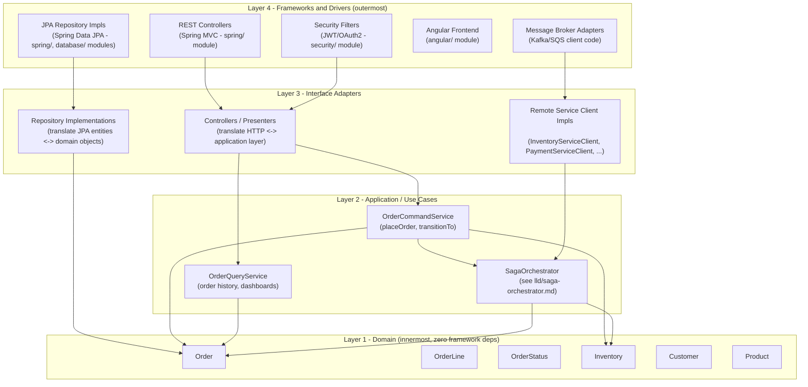

# Clean / Hexagonal Architecture Layering

See README Section 11 for the full discussion, including the retroactive callout that `java-basics/`'s domain classes already satisfy this discipline.

## The dependency rule

Arrows point from outer layers toward inner layers only. `Order` (Layer 1) has **no idea** that `OrderCommandService` (Layer 2), `Controllers` (Layer 3), or Spring/JPA/Angular (Layer 4) exist. This is what lets Layer 1 be unit-tested with zero framework, zero database, zero running server — exactly how `java-basics/src/main/java/com/interviewprep/orders/domain/` is written and tested today (`Main.java` exercises it directly with `System.out.println`, no test framework or infrastructure required, per that module's `EXERCISES.md`).

## Mapping this repo's actual folders onto the layers

| Layer | This repo's module(s) |
|---|---|
| L1 — Domain | `java-basics/src/main/java/com/interviewprep/orders/domain/` (`Customer`, `Product`, `Order`, `OrderLine`, `OrderStatus`, `Inventory`, `InsufficientStockException`) |
| L2 — Application / Use Cases | `java-basics/src/main/java/com/interviewprep/orders/service/OrderService.java` today (single-process); evolves into `OrderCommandService` + `OrderQueryService` (CQRS, README Section 4) + `SagaOrchestrator` ([lld/saga-orchestrator.md](../lld/saga-orchestrator.md)) once persistence and distribution are introduced |
| L3 — Interface Adapters | Repository interfaces/implementations and remote-service-client implementations introduced in `spring/` and this module's `lld/orderplacement/*ServiceClient` interfaces |
| L4 — Frameworks & Drivers | `spring/` (Spring MVC, Spring Data JPA), `security/` (Spring Security filters), `database/` (actual PostgreSQL/Oracle), `angular/` (the UI) |

## Why this matters for the microservices-vs-monolith recommendation (Section 9)

Because Layer 1 and most of Layer 2 have zero framework/network dependencies, the modular monolith described in Section 9 can enforce bounded-context boundaries (Section 10) as plain Java package/module boundaries within Layers 1–2, while Layers 3–4 stay a single deployable. If and when a bounded context is later extracted into its own service, only Layer 3 (new adapter implementations making real network calls instead of in-process calls) and Layer 4 (a new deployable, new infrastructure) change — Layer 1's domain logic and most of Layer 2's use-case logic transfer across unchanged. This is the concrete mechanism behind the claim in Section 9 that a modular monolith with real boundaries makes a later split "an extraction," not "a rewrite."
