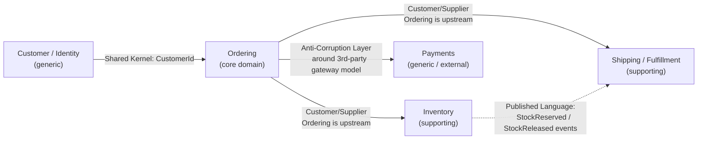

# DDD Context Map — Order/Inventory Domain

See README Section 10 for the full discussion of each bounded context and relationship type. This diagram is the visual reference.

## Relationship legend

| Relationship | Between | Meaning |
|---|---|---|
| Customer/Supplier | Ordering → Inventory, Ordering → Fulfillment | Ordering (upstream) drives what it needs from the downstream context; downstream serves that need on its own terms/model |
| Anti-Corruption Layer (ACL) | Ordering → Payments | Payments' shape is set by an external, third-party gateway; a translation layer prevents that external model from leaking into the rest of the domain |
| Shared Kernel | Identity ↔ Ordering | A small, deliberately shared model fragment (`CustomerId`) both contexts agree to change only by mutual consent |
| Published Language | Inventory → Fulfillment | Inventory publishes well-defined domain events; consumers (Fulfillment, and others) subscribe without coupling to Inventory's internal model — the DDD-vocabulary version of choreography (README Section 6) |

## Why `Ordering` is the core domain

`Ordering` gets the label "core domain" (as opposed to "supporting" or "generic") because it's where this business's actual competitive differentiation lives — how orders are placed, validated, and fulfilled is the product. `Inventory` and `Fulfillment` are necessary and important but are largely the same problem any company selling physical goods has to solve ("supporting" — worth building well, not worth over-investing in beyond what the business needs). `Payments` and `Identity` are labeled "generic" because most companies solve them by integrating a specialized third party (a payment gateway, an identity provider) rather than building bespoke solutions — reinventing either is rarely where a mid-size company's engineering investment should go, which is also why both are wrapped behind explicit translation boundaries (ACL for Payments, Shared Kernel for Identity) rather than being modeled as first-class, deeply-integrated parts of the core domain.

## How this maps to Section 9's microservices-vs-monolith recommendation

The bounded-context lines drawn here are deliberately the *same* lines a future service extraction would cut along (README Section 9). This is not a coincidence — it's the entire reason to invest in explicit bounded contexts even while running as a modular monolith: the context map above is usable, unchanged, as the target microservices topology in [hld-microservices.md](hld-microservices.md) the day a real scaling or team-ownership need justifies splitting one of these contexts out.
