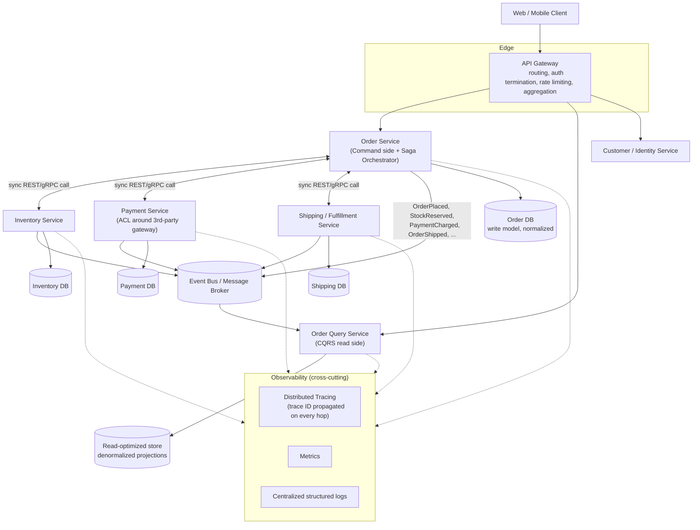

# HLD — Microservices Split with API Gateway

This is the high-level design the Order/Inventory system evolves into **if and when** Module 13's README Section 9 recommendation ("start as a modular monolith, split only when justified") is eventually acted on for one or more bounded contexts. Treat this as the target shape to reason about in an interview, not a claim that this repo's `java-basics`/`spring` modules should be physically split today.

## Reading this diagram

- **API Gateway** (README Section 8) is the only component external clients ever talk to. It terminates auth, applies rate limits, routes by path, and can aggregate (e.g. compose an order-confirmation response from Order + Customer + Shipping in one round trip for the client).
- **Order Service** hosts the **Saga Orchestrator** (README Section 6, detailed in [../lld/saga-orchestrator.md](../lld/saga-orchestrator.md)) — it is the one component that knows the full order-placement workflow and calls out to Inventory, Payment, and Shipping in sequence, with compensations on failure.
- **CQRS split** (README Section 4): `OrderSvc` (command side, writes to the normalized `OrderDb`) is a separate deployable/model from `QuerySvc` (read side, serves from a denormalized `ReadDb` kept up to date via the event bus) — a client asking "what are my last 10 orders" never touches the command-side database at all.
- **Each service owns its own database** (a core microservices tenet — "database per service") — this is *why* the Saga pattern is required in the first place: there is no shared database to wrap a single ACID transaction around `OrderSvc` + `InventorySvc` + `PaymentSvc` + `ShippingSvc`.
- **The event bus** is used two ways simultaneously in this diagram: (a) feeding the CQRS read-model projector, and (b) as the transport for a choreography-style saga variant if one were used instead of/alongside orchestration (README Section 6's comparison table) — services publish domain events regardless of whether the orchestrator or other services are the actual consumer.
- **Observability** is drawn as cross-cutting rather than a box any one service owns, because a trace ID generated at the Order Service must be propagated through every synchronous call (to Inventory/Payment/Shipping) and ideally through the event bus too, so one saga's full journey can be reconstructed (README Section 12).

## What this diagram deliberately leaves out

- Load balancers / multiple instances per service (implied — every box here is "a service," not "one instance of a service"; README Section 1 covers why each instance must be stateless).
- Specific AWS resources (ECS/EKS/Lambda, ALB, SQS/SNS/EventBridge) — that mapping is the `aws/` module's territory; this diagram is intentionally cloud-agnostic HLD.
- Auth/identity provider internals (OIDC flows, token issuance) — that's the `security/` module's territory; here, "auth termination" at the gateway is a black box that produces a trusted identity for downstream services.
