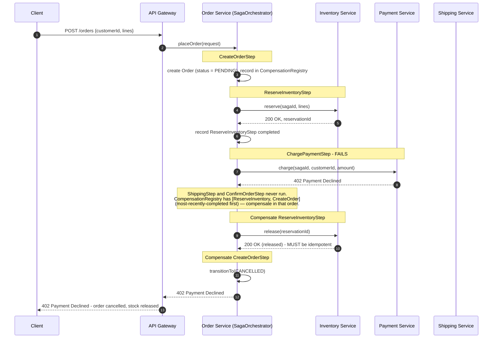

# Saga Sequence Diagram — Failure and Compensation Path

Same flow as [saga-happy-path.md](saga-happy-path.md), except `ChargePaymentStep` fails (e.g. the customer's card is declined). Compare directly against `java-basics`' `OrderService.placeOrder()` catch block — this is that same "walk backwards through everything completed and undo it" logic, now spanning three separately-deployed services instead of one in-memory `Inventory`.

## Reading this diagram

- **Compensation order is strictly reverse of completion order**: `ReserveInventoryStep` is undone before `CreateOrderStep`, exactly like `java-basics`' `for (OrderLine line : reserved)` walking its `ArrayDeque` stack from most-recently-pushed to least. `ChargePaymentStep` itself needs no compensation here — it never completed, so there's nothing to undo for that step (compare against the compensation table in the README's Section 6, which lists `RefundPayment` as the compensation *for* `ChargePaymentStep`, used only when a step *after* payment fails).
- **`release(reservationId)` must be idempotent.** If the orchestrator crashes right after sending this call but before recording that compensation succeeded, a retry-on-recovery will call `release` again with the same `reservationId` — the Inventory service must treat a second release of an already-released reservation as a no-op success, not an error or a double-release of stock.
- **If a compensation itself fails** (not shown above for clarity — see [../lld/saga-orchestrator.md](../lld/saga-orchestrator.md)'s `CompensationRegistry.compensateAll`), the orchestrator does not abort the rest of the rollback: every remaining compensation is still attempted best-effort, and the failure is logged/alerted for manual reconciliation. Aborting entirely on the first compensation failure would leave the system in a state that's worse than either fully forward or fully rolled back (e.g. stock never released *and* the order never explicitly cancelled).
- **The client only sees one clean outcome** (`402 Payment Declined`) despite three services and two compensations happening behind the scenes — this is the point of the Saga pattern: the caller-visible contract ("this either all worked or none of it did, from your perspective") is preserved even though the underlying implementation cannot use a single ACID transaction to guarantee it.
