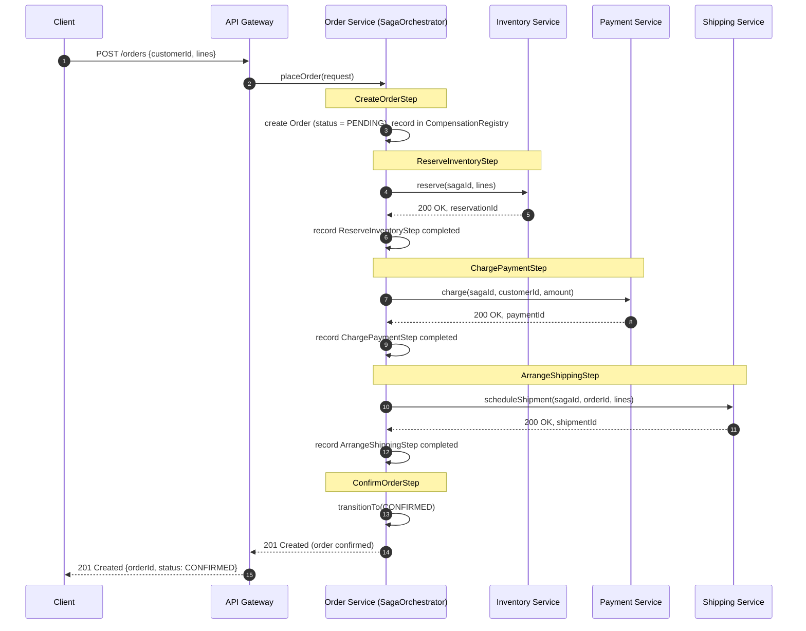

# Saga Sequence Diagram — Happy Path

The distributed generalization of `java-basics`' `OrderService.placeOrder()` when Order, Inventory, Payment, and Shipping are separate services. Every step below corresponds directly to a `SagaStep` implementation in [../lld/src/main/java/com/interviewprep/orders/saga/](../lld/src/main/java/com/interviewprep/orders/saga/) — see [../lld/saga-orchestrator.md](../lld/saga-orchestrator.md) for the class design.

## Reading this diagram

- Every step is recorded in the `CompensationRegistry` **only after it succeeds** — this mirrors `reserved.push(line)` only running *after* `inventory.reserve(...)` returns without throwing in `java-basics`' `OrderService.placeOrder()`. If a step is recorded before it actually succeeds, a subsequent failure would try to compensate a step that never really completed.
- Each cross-service call (`reserve`, `charge`, `scheduleShipment`) is drawn as a single request/response for clarity, but in production each of these calls sits behind the circuit breaker / retry-with-jitter machinery from the README's Section 7 — a transient failure on any of these calls is retried before it's treated as a saga-level failure at all.
- `ConfirmOrderStep` has no remote call — it's a local state transition (`Order.transitionTo(CONFIRMED)`, exactly the Module 1 method), which is why it has no compensation of its own in the happy path (nothing after it to undo).
- Compare this diagram directly against [saga-compensation-path.md](saga-compensation-path.md), which is the same flow with `ChargePaymentStep` failing instead of succeeding.
