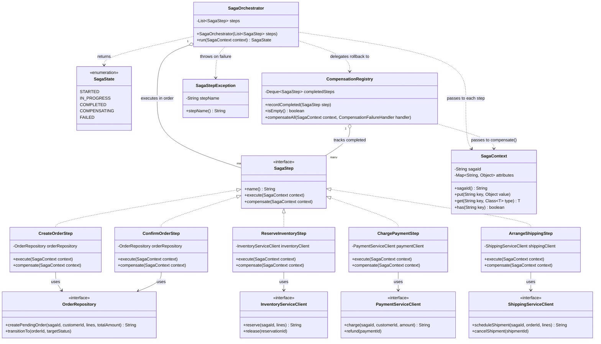

# LLD — Saga Orchestrator (Order Placement)

A deeper low-level design for the single component this module treats as its centerpiece (README.md Section 6): an orchestration-based Saga Orchestrator that generalizes `java-basics`' `OrderService.placeOrder()` rollback loop across separate Order, Inventory, Payment, and Shipping services.

**Code:** [src/main/java/com/interviewprep/orders/saga/](src/main/java/com/interviewprep/orders/saga/) — illustrative, written and carefully re-read for structural correctness, **not compiled** (this sandbox has no `java`/`javac`; see the repo-wide constraint noted in every file's header comment). Package `com.interviewprep.orders.saga`, with order-placement-specific wiring under `com.interviewprep.orders.saga.orderplacement`.

## Class diagram

## Design rationale — walking the diagram

- **`SagaOrchestrator`** holds an ordered `List<SagaStep>` and is the only class that knows the *sequence* of the order-placement flow (`CreateOrder → ReserveInventory → ChargePayment → ArrangeShipping → ConfirmOrder`). This centralization is exactly what "orchestration" means as opposed to "choreography" (README.md Section 6) — read `OrderPlacementSagaFactory.create()` and the whole flow is visible in one place.
- **`SagaStep`** is a narrow interface (`name`, `execute`, `compensate`) — every step, regardless of which downstream service it calls, looks identical to the orchestrator. This is what lets `SagaOrchestrator` be written once and reused for any saga (order placement today; a future returns/refund saga, or a supplier-restocking saga, could reuse the exact same `SagaOrchestrator`/`CompensationRegistry` classes with a different `List<SagaStep>`).
- **`SagaContext`** is the one mutable object threaded through every step — the distributed-saga replacement for local variables/method parameters that a single-process method body would otherwise use directly (see its Javadoc for the direct mapping).
- **`CompensationRegistry`** is deliberately a separate class from `SagaOrchestrator`, not an inline `Deque` local variable, specifically because — unlike `java-basics`' `reserved` local variable, which can safely vanish when `placeOrder()` returns or throws — a real orchestrator's "what completed so far" list must be durable enough to survive an orchestrator crash mid-saga. Making it its own class is what makes that persistence concern addressable in one place (a real implementation would back it with a database table) without entangling it into `SagaOrchestrator`'s control-flow logic.
- **`SagaStepException`** always wraps the *original* failure as its cause (never swallowed), mirroring `java-basics`' `InsufficientStockException` handling and the repo-wide "never lose the cause" rule from that module's Exception Handling section.
- **`OrderRepository` vs. the three `*ServiceClient` interfaces** is a deliberate asymmetry, not an oversight: per the HLD ([../diagrams/hld-microservices.md](../diagrams/hld-microservices.md)), the orchestrator lives inside the Order Service, which owns `Order` directly — so `CreateOrderStep`/`ConfirmOrderStep` use a local repository, exactly like `java-basics`' `OrderService` constructs and mutates `Order` in-process today. Only steps crossing into a genuinely different service (Inventory, Payment, Shipping) go through a network-client interface with the idempotency contract that implies.

## Where this maps back to `java-basics`

| `java-basics` (Module 1, in-process) | This LLD (Module 13, distributed) |
|---|---|
| `Deque<OrderLine> reserved` (local variable) | `CompensationRegistry` (own class, durable) |
| `try { ... } catch (InsufficientStockException e) { ... }` | `SagaOrchestrator.run()`'s try/catch per step |
| `inventory.reserve(sku, qty)` | `ReserveInventoryStep.execute()` calling `InventoryServiceClient.reserve(...)` |
| `inventory.release(sku, qty)` | `ReserveInventoryStep.compensate()` calling `InventoryServiceClient.release(...)` |
| `throw e;` (preserve original exception) | `throw new SagaStepException(step.name(), stepFailure);` (cause preserved) |
| `Order.transitionTo(OrderStatus)` | `OrderRepository.transitionTo(orderId, targetStatus)`, called from `CreateOrderStep`/`ConfirmOrderStep` |

See [../EXPLANATION.md](../EXPLANATION.md) for a line-by-line walkthrough of the actual Java files, and [../diagrams/saga-happy-path.md](../diagrams/saga-happy-path.md) / [../diagrams/saga-compensation-path.md](../diagrams/saga-compensation-path.md) for this same design as an executed sequence.
