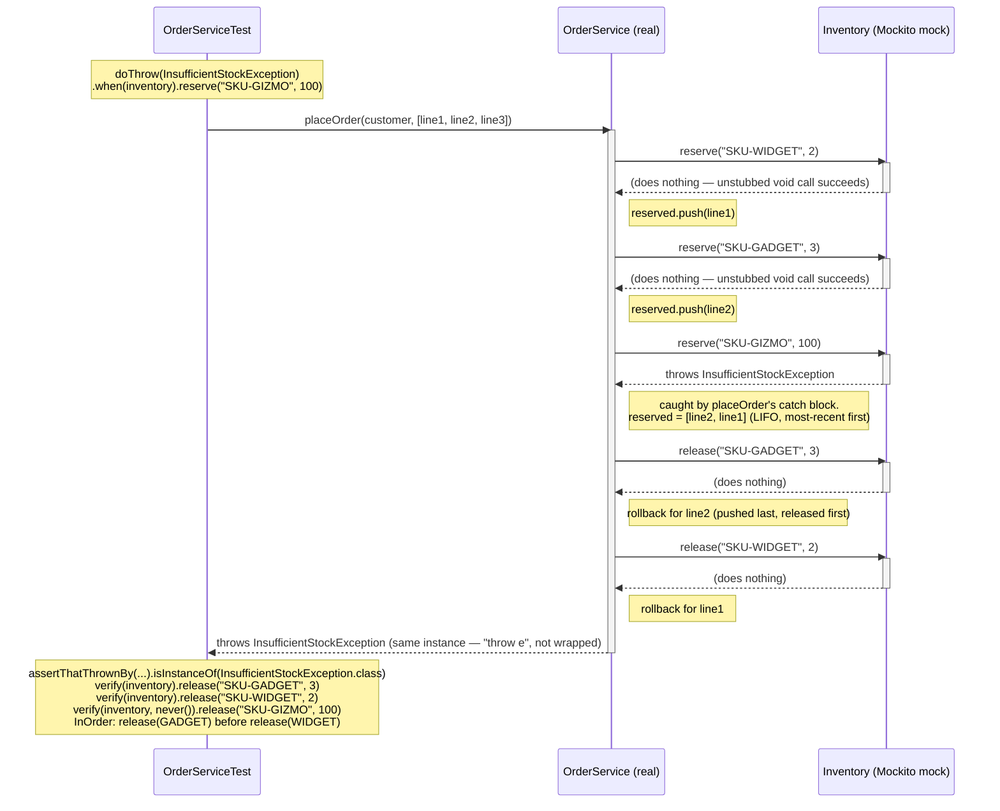

# Sequence Diagram — `OrderServiceTest`'s mocked rollback scenario

This traces exactly what happens inside
[`OrderServiceTest.PlaceOrderRollback.releasesEveryPreviouslyReservedLineWhenALaterLineFailsAndRethrows()`](../src/test/java/com/interviewprep/orders/service/OrderServiceTest.java),
the centerpiece test of this module. `Inventory` here is a **Mockito mock**, not the
real class from `java-basics` — everything it "does" below is exactly what the test
told it to do via `doThrow(...)` (for the third call) or Mockito's default
do-nothing behavior for an unstubbed void method (for the first two calls).

## What this diagram makes visible that the code alone doesn't

- **The rollback order is LIFO, not FIFO.** `OrderService` tracks successfully
  reserved lines in an `ArrayDeque` used as a stack (`push()` on success). Iterating
  it in the `catch` block therefore visits the *most recently* reserved line first —
  line2 (gadget) is released before line1 (widget), the reverse of reservation
  order. `OrderServiceTest` pins this down with a Mockito `InOrder` verification
  specifically so a refactor that silently reverses this order gets caught.
- **The failing line is never released.** `reserve("SKU-GIZMO", 100)` throws
  *before* `Inventory` would have mutated any state for that SKU — so it's correctly
  excluded from the rollback loop, and the test asserts `release()` is never called
  for it (`verify(inventory, never())...`). Releasing it would double-credit stock
  that was never actually taken.
- **The exception instance is preserved, not wrapped.** The arrow back to
  `OrderServiceTest` at the bottom shows the *original* `InsufficientStockException`
  propagating unchanged — `OrderService`'s catch block re-throws it (`throw e`)
  rather than catching and wrapping it in a new exception, which would destroy the
  original stack trace (see `java-basics/README.md`'s Exception Handling section).
