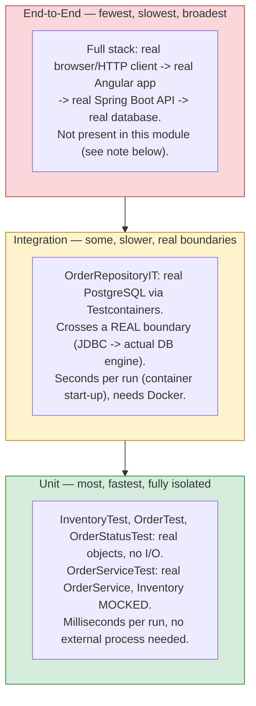

# The Test Pyramid — applied to this module

The three tiers below map directly onto the test files in
[../src/test/java/com/interviewprep/orders](../src/test/java/com/interviewprep/orders):
`InventoryTest`/`OrderTest`/`OrderStatusTest`/`OrderServiceTest` are unit tests,
`OrderRepositoryIT` is an integration test, and there is deliberately no
end-to-end test in this module (see the note at the bottom for why).

## Why the shape is a pyramid, not a rectangle or an inverted pyramid

| Tier | What it verifies | Speed | Count (this module) | Failure tells you |
|---|---|---|---|---|
| Unit | A single class's logic, in isolation from its collaborators | Milliseconds | ~20 test methods across 4 classes | Exactly which method/branch is wrong — the blast radius is one class |
| Integration | That a real boundary (DB, message broker, another service) behaves the way your code assumes | Seconds (container start-up) | 3 test methods, 1 class | A boundary assumption is wrong — code and DB (or code and network) disagree |
| End-to-end | That the whole system, wired together for real, satisfies a user-facing scenario | Seconds to minutes, often flaky | 0 in this module | Something in the integration of many parts is wrong — least specific, most expensive to debug |

A healthy suite has **many** fast, isolated unit tests (cheap enough to run on every
keystroke), **some** integration tests around each real external boundary (expensive
enough that you don't want thousands of them, valuable enough that skipping them
entirely is dangerous), and **few** end-to-end tests (each one is slow and brittle
enough that a large number becomes a maintenance burden that discourages running
the suite at all — the "ice cream cone" anti-pattern is exactly this pyramid
inverted, where teams over-invest in E2E and under-invest in unit tests, ending up
with a slow, flaky suite nobody trusts).

## Why no end-to-end test in this module

An end-to-end test here would mean driving a real HTTP client against a running
Spring Boot instance (`spring/`, Module 5) backed by a real database (`database/`,
Module 7), possibly through a real Angular UI (`angular/`, Module 9). None of those
modules are guaranteed to exist yet at the time this module was built (they are
separate, possibly-concurrent modules in this curriculum) — writing one now would
either not compile against modules that don't exist, or use a fake stand-in that
wouldn't actually be testing "end-to-end" at all. Once those modules exist, an
end-to-end test belongs in a cross-cutting location (or its own module) that can
depend on all of them, not inside `testing/`, which this curriculum scopes to
JUnit/Mockito/Testcontainers mechanics against the `java-basics` domain.
